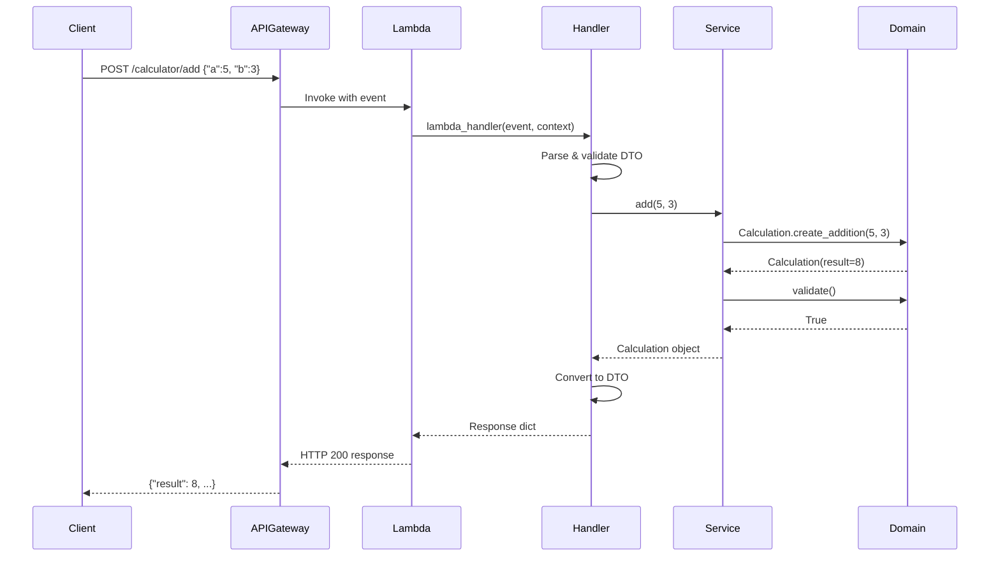
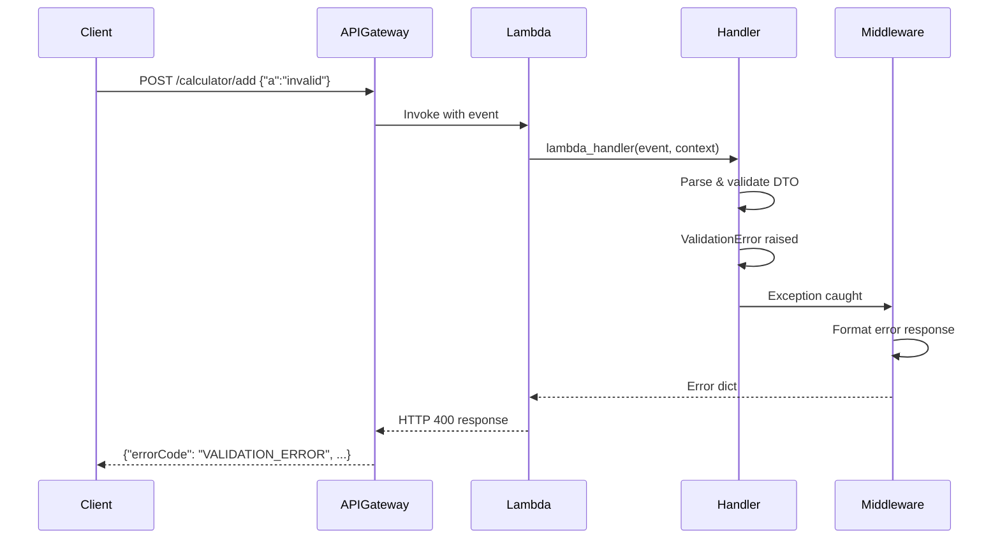

# Calculator API - Design Document

**Date**: 2026-03-27
**Status**: Draft
**Version**: 1.0
**Based on**: calculator-requirements.md v1.0

---

## 1. Design Overview

### Architecture Pattern
**Clean Architecture** with **Aspect-Oriented Programming (AOP)** for cross-cutting concerns

### Layer Separation
```
API Gateway → Handler (HTTP) → Service (Business Logic) → Domain (Pure Logic)
                ↓                    ↓                        ↓
              DTO Layer         @observe decorator      Domain Objects
```

### Design Principles
- **Domain-Driven Design**: Pure domain objects with no external dependencies
- **Separation of Concerns**: Each layer has single responsibility
- **Dependency Inversion**: Layers depend on abstractions, not concrete implementations
- **AOP Pattern**: Cross-cutting concerns (logging, metrics, tracing) handled by decorators

---

## 1A. Design Decisions & Ambiguity Resolution

This section formally addresses ambiguities identified in calculator-requirements.md Section 12.

### Decision 1: Overflow Handling

**Ambiguity**: Requirements don't specify behavior when result exceeds float range.

**Options Considered**:
1. Raise ValidationError and return 400 (treat as client error)
2. Allow Python's native `inf`/`-inf` behavior
3. Use Pydantic constraint to reject infinity values

**Decision**: **Allow Python's native behavior** (Option 2)

**Rationale**:
- Python's IEEE 754 float naturally handles overflow as `inf`/`-inf`
- Calculation domain validates result correctness with tolerance
- Client receives valid JSON response with `"result": Infinity` (JSON standard)
- Business rule BR-003 states "Result maintains Python float precision" - this includes Python's overflow behavior

**Implementation**:
```python
# No special handling needed - Python handles naturally
calc = Calculation.create_addition(1e308, 1e308)
# calc.result == float('inf')  ✅ Valid
```

**Alternative for future**: If business requirements change, add Pydantic validator:
```python
class CalculatorResponse(BaseModel):
    result: float = Field(..., allow_inf_nan=False)  # Would reject infinity
```

---

### Decision 2: Rate Limiting & Throttling

**Ambiguity**: Concurrent request volume not specified in requirements.

**Options Considered**:
1. Use API Gateway default throttling (10,000 RPS burst, 5,000 RPS steady)
2. Apply restrictive limits (100 RPS for MVP)
3. Add WAF rate limiting per client IP

**Decision**: **API Gateway throttling + CloudWatch alarms** (Hybrid of Options 1 & 2)

**Configuration**:
```python
# In CDK stack
deploy_options=apigw.StageOptions(
    throttling_rate_limit=500,    # 500 requests/second steady state
    throttling_burst_limit=1000   # 1000 requests/second burst
)
```

**Rationale**:
- Matches Hello World API throttling (consistency)
- Calculator is more compute-intensive than Hello World (addition operation)
- CloudWatch alarms will alert on high request volume
- Can adjust post-launch based on actual usage

**Monitoring**:
- CloudWatch alarm: `RequestCount > 400/sec for 2 periods` → alert
- X-Ray traces will show throttling events

---

### Decision 3: Authentication & Authorization

**Ambiguity**: Requirements don't specify if API requires authentication.

**Options Considered**:
1. Public API (no authentication)
2. API Gateway API key
3. AWS Cognito integration
4. IAM authorization (AWS SigV4)

**Decision**: **Public API for MVP** (Option 1)

**Rationale**:
- Calculator operations are non-sensitive (no PII, no business-critical data)
- Simplifies initial implementation and testing
- Throttling provides DDoS protection
- Can add authentication later without breaking existing clients (additive change)

**Security Measures**:
- API Gateway throttling limits abuse
- WAF can be added for additional protection (not in initial scope)
- CloudWatch alarms alert on suspicious traffic patterns

**Future Enhancement**:
```python
# When auth is needed, add:
hello_resource.add_method(
    "POST",
    integration,
    authorization_type=apigw.AuthorizationType.COGNITO,
    authorizer=cognito_authorizer
)
```

---

### Decision 4: Numeric Precision & Rounding

**Implicit Ambiguity**: Float precision behavior not explicitly defined.

**Decision**: **Use Python's native IEEE 754 double precision**

**Specification**:
- Precision: 15-17 significant decimal digits
- Range: -1.7976931348623157e+308 to 1.7976931348623157e+308
- Tolerance: 1e-10 for validation comparisons

**Rationale**:
- Technical requirement TR-007 specifies "standard IEEE 754 double precision"
- No business requirement for arbitrary precision (e.g., Decimal)
- Performance: float operations are faster than Decimal
- Validation uses tolerance to account for floating-point arithmetic

**Edge Case Handling**:
```python
# Validation tolerance handles float arithmetic
assert abs(result - expected) > 1e-10  # Accounts for 0.1 + 0.2 = 0.30000000000000004
```

---

## 2. API Design

### Endpoint Specification

**POST /calculator/add**

**Request**:
```json
{
  "a": 5.5,
  "b": 3.2
}
```

**Response (200 OK)**:
```json
{
  "a": 5.5,
  "b": 3.2,
  "operation": "add",
  "result": 8.7,
  "timestamp": "2026-03-27T10:00:00.123456Z"
}
```

**Error Response (400 Bad Request)**:
```json
{
  "errorCode": "VALIDATION_ERROR",
  "message": "Field 'a' is required and must be a number",
  "correlationId": "trace-id-12345",
  "timestamp": "2026-03-27T10:00:00.123456Z"
}
```

**Error Response (500 Internal Server Error)**:
```json
{
  "errorCode": "INTERNAL_ERROR",
  "message": "An internal error occurred",
  "correlationId": "trace-id-12345",
  "timestamp": "2026-03-27T10:00:00.123456Z"
}
```

---

## 3. Domain Model

### Calculation (Domain Entity)

**File**: `src/domain/calculation.py`

```python
@dataclass(frozen=True)
class Calculation:
    """Pure domain object representing a calculation."""
    operand_a: float
    operand_b: float
    operation: str
    result: float
    timestamp: datetime

    @classmethod
    def create_addition(cls, a: float, b: float) -> "Calculation":
        """Factory method for addition operation."""
        result = a + b
        return cls(
            operand_a=a,
            operand_b=b,
            operation="add",
            result=result,
            timestamp=datetime.now(timezone.utc)
        )

    def validate(self) -> bool:
        """Validate calculation consistency.

        Business Rules:
        - Operation must be "add"
        - Result must match expected calculation
        - Timestamp must be timezone-aware UTC

        Returns:
            bool: True if valid

        Raises:
            ValueError: If validation fails
        """
        # Validate operation type
        if self.operation != "add":
            raise ValueError(f"Unknown operation: {self.operation}")

        # Validate result correctness (with float comparison tolerance)
        expected = self.operand_a + self.operand_b
        tolerance = 1e-10
        if abs(self.result - expected) > tolerance:
            raise ValueError(
                f"Calculation result is incorrect. Expected {expected}, got {self.result}"
            )

        # Validate timestamp is timezone-aware
        if self.timestamp.tzinfo is None:
            raise ValueError("Timestamp must be timezone-aware")

        return True
```

**Design Rationale**:
- **Frozen dataclass**: Immutability ensures thread safety
- **Factory method**: Encapsulates creation logic
- **Self-validation**: Domain object validates its own consistency
- **No external dependencies**: Pure domain logic

**Note on Result Validation** (Addressing Architectural Review):

The `validate()` method includes result verification:
```python
expected = self.operand_a + self.operand_b
if abs(self.result - expected) > tolerance:
    raise ValueError("Calculation result is incorrect")
```

**Reviewer's Observation**: Since `Calculation` is `frozen=True` and created via `create_addition()` factory method, the result is always `a + b`, making this check appear redundant.

**Design Decision**: **Keep the validation** for the following reasons:

1. **Defensive Programming**: While currently redundant, this protects against:
   - Future direct instantiation (if frozen constraint removed)
   - Deserialization from external sources (JSON, database)
   - Manual object construction in tests

2. **Domain Invariant Documentation**: The validation explicitly states the business rule: "result must equal operand_a + operand_b". This serves as executable documentation.

3. **Fail-Fast Principle**: If somehow an invalid Calculation is created (e.g., reflection, pickle deserialization), validation catches it immediately rather than propagating invalid state.

4. **Test Coverage**: Validation has explicit test coverage (`test_validate_incorrect_result`), demonstrating the expected behavior.

**Alternative Considered**: Remove result validation since it's currently redundant.

**Trade-off**: 3 extra lines of code + ~10ns execution time vs. protection against future architectural changes.

**Verdict**: Retain validation. The cost is negligible, and it provides defense-in-depth for domain integrity.

---

## 4. DTO Layer

### CalculatorRequest (Input DTO)

**File**: `src/dto/request.py`

```python
class CalculatorRequest(BaseModel):
    """Request DTO for calculator operations."""
    a: float = Field(..., description="First operand")
    b: float = Field(..., description="Second operand")

    model_config = ConfigDict(
        json_schema_extra={
            "example": {
                "a": 5.5,
                "b": 3.2
            }
        }
    )
```

**Design Rationale**:
- **Pydantic validation**: Automatic type checking and validation
- **Field descriptors**: Clear API documentation
- **JSON schema**: Auto-generated API docs

### CalculatorResponse (Output DTO)

**File**: `src/dto/response.py`

```python
class CalculatorResponse(BaseModel):
    """Response DTO for calculator operations."""
    a: float
    b: float
    operation: str
    result: float
    timestamp: str

    @classmethod
    def from_calculation(cls, calc: Calculation) -> "CalculatorResponse":
        """Convert domain object to DTO."""
        return cls(
            a=calc.operand_a,
            b=calc.operand_b,
            operation=calc.operation,
            result=calc.result,
            timestamp=calc.timestamp.strftime("%Y-%m-%dT%H:%M:%S.%fZ")
        )

    def to_dict(self) -> dict:
        """Convert to JSON-serializable dict."""
        return self.model_dump()
```

**Design Rationale**:
- **Conversion method**: Clean transformation from domain to DTO
- **Timestamp formatting**: Consistent ISO 8601 format
- **Separation**: DTO knows about domain, but domain doesn't know about DTO

---

## 5. Service Layer

### CalculatorService

**File**: `src/services/calculator_service.py`

```python
class CalculatorService:
    """Service for calculator operations.

    Implements business logic for mathematical calculations.
    All observability handled by @observe decorator.
    """

    def __init__(self) -> None:
        """Initialize CalculatorService."""
        pass

    @observe(operation="add_numbers", metric_prefix="calculator_add")
    def add(self, a: float, b: float) -> Calculation:
        """Perform addition of two numbers.

        Business Rules:
        - BR-001: Both operands must be numeric
        - BR-003: Result maintains float precision

        Observability:
        - Tracing, metrics, and logging handled by @observe decorator
        - Creates OpenTelemetry span with status
        - Records counter + histogram metrics
        - Logs entry/exit with structured context

        Args:
            a: First operand
            b: Second operand

        Returns:
            Calculation: Domain object with result
        """
        # Pure business logic - no observability boilerplate
        calculation = Calculation.create_addition(a, b)
        calculation.validate()
        return calculation
```

**Design Rationale**:
- **Pure business logic**: Only calculation logic, no observability code
- **@observe decorator**: All cross-cutting concerns externalized
- **Domain object return**: Service layer returns domain objects, not DTOs
- **Validation**: Ensures business rule compliance

---

## 6. Handler Layer

### CalculatorHandler

**File**: `src/handlers/calculator_handler.py`

```python
from src.middleware.api_gateway import api_gateway_handler
from src.services.calculator_service import CalculatorService
from src.dto.request import CalculatorRequest
from src.dto.response import CalculatorResponse

@api_gateway_handler
def lambda_handler(event: dict, context: Any, trace_id: str) -> dict:
    """Lambda entry point for Calculator API.

    Args:
        event: API Gateway proxy event
        context: Lambda context
        trace_id: Extracted X-Ray trace ID provided by AOP middleware

    Returns:
        dict: The DTO payload. @api_gateway_handler will automatically format it
              as a proper HTTP 200 JSON API Gateway response.

    Raises:
        ValidationError: If request body is invalid (caught by middleware)
        Exception: Any unexpected error (caught by middleware, returns 500)
    """
    return handle_add_request(event)


def handle_add_request(event: dict) -> dict:
    """Handle POST /calculator/add request.

    Handler layer responsibilities:
    1. Parse and validate request body (DTO)
    2. Call service layer (gets domain object)
    3. Convert domain object to DTO

    Args:
        event: API Gateway proxy event

    Returns:
        dict: The JSON-serializable DTO response payload

    Raises:
        ValidationError: If request body validation fails
    """
    # Parse request body
    body = json.loads(event.get('body', '{}'))

    # Validate using Pydantic DTO
    request_dto = CalculatorRequest(**body)

    # Instantiate service
    calculator_service = CalculatorService()

    # Get domain object from service layer
    calculation = calculator_service.add(request_dto.a, request_dto.b)

    # Convert domain object to DTO (handler layer responsibility)
    response_dto = CalculatorResponse.from_calculation(calculation)

    return response_dto.to_dict()
```

**Design Rationale**:
- **@api_gateway_handler**: HTTP concerns externalized to middleware
- **DTO validation**: Pydantic validates request at API boundary
- **Domain to DTO conversion**: Handler converts domain objects to DTOs
- **Error handling**: Middleware catches all exceptions
- **No observability code**: All handled by decorators

---

## 7. Middleware Design

### Reuse Existing Middleware

**api_gateway_handler decorator** (already exists):
- Extracts trace ID from headers
- Logs API request entry/exit
- Catches exceptions and returns 500 errors
- Formats HTTP responses
- Adds proper headers (Content-Type, X-Trace-Id)

**observe decorator** (already exists):
- Creates OpenTelemetry spans
- Records metrics (counter + histogram)
- Logs structured events (entry/exit/error)
- Handles exceptions with full context

**No new middleware needed** - reuse existing patterns from Hello World API.

---

## 8. Error Handling Strategy

### Error Handling Architecture

All exceptions are caught by the `@api_gateway_handler` middleware decorator, which maps exceptions to appropriate HTTP status codes.

**Exception Hierarchy**:
```
ValidationError (pydantic)    → HTTP 400 Bad Request
ValueError (domain logic)     → HTTP 500 Internal Server Error
Exception (all others)        → HTTP 500 Internal Server Error
```

---

### Validation Errors (400 Bad Request)

**Trigger**: `pydantic.ValidationError` raised when parsing request DTO

**When it occurs**:
```python
request_dto = CalculatorRequest(**body)  # Raises ValidationError if invalid
```

**Middleware Handler** (`src/middleware/api_gateway.py`):
```python
except ValidationError as e:
    logger.warning(
        "API Request failed validation",
        extra={
            "error": str(e),
            "error_type": "ValidationError",
            "trace_id": trace_id,
            "validation_errors": e.errors()  # Pydantic error details
        }
    )

    error_response = ErrorResponse.create_validation_error(trace_id, str(e))

    return {
        'statusCode': 400,
        'headers': {
            'Content-Type': 'application/json',
            'X-Trace-Id': trace_id
        },
        'body': json.dumps(error_response.to_dict())
    }
```

**Response Format**:
```json
{
  "errorCode": "VALIDATION_ERROR",
  "message": "Request validation failed: Field required [field: 'b']",
  "correlationId": "trace-id-12345",
  "timestamp": "2026-03-27T10:00:00.123456Z"
}
```

**Example Validation Errors**:
- Missing field: `{"a": 5}` → "Field required [field: 'b']"
- Wrong type: `{"a": "text", "b": 3}` → "Input should be a valid number"
- Null value: `{"a": null, "b": 3}` → "Input should be a valid number"

---

### Internal Errors (500 Internal Server Error)

**Trigger**: Any exception not caught as ValidationError

**Common Scenarios**:
- Domain validation failure: `ValueError` from `Calculation.validate()`
- Service layer exceptions: Unexpected errors in business logic
- Infrastructure errors: Database, network, etc.

**Middleware Handler** (`src/middleware/api_gateway.py`):
```python
except Exception as e:
    logger.error(
        "API Request failed with systemic error",
        extra={
            "error": str(e),
            "error_type": type(e).__name__,
            "trace_id": trace_id
        },
        exc_info=True  # Full stack trace in logs
    )

    error_response = ErrorResponse.create_internal_error(trace_id)

    return {
        'statusCode': 500,
        'headers': {
            'Content-Type': 'application/json',
            'X-Trace-Id': trace_id
        },
        'body': json.dumps(error_response.to_dict())
    }
```

**Response Format** (Generic - no sensitive details):
```json
{
  "errorCode": "INTERNAL_ERROR",
  "message": "An internal error occurred",
  "correlationId": "trace-id-12345",
  "timestamp": "2026-03-27T10:00:00.123456Z"
}
```

**Security Note**: Internal error messages never expose:
- Stack traces (only in CloudWatch Logs)
- Database connection strings
- Internal system details
- Business logic details

Client receives generic message; correlationId allows support team to find full details in logs.

---

### Error Handling Order of Execution

**Critical**: ValidationError MUST be caught before generic Exception:

```python
try:
    result = func(event, context, trace_id)
    return format_response(result)
except ValidationError as e:    # ✅ FIRST - Specific exception
    return format_400_response(e)
except Exception as e:           # ✅ SECOND - Catch-all
    return format_500_response(e)
```

**Rationale**: Python evaluates except blocks top-to-bottom. If `Exception` comes first, it will catch `ValidationError` (since ValidationError inherits from Exception), preventing proper 400 response.

---

### Implementation Status

**✅ IMPLEMENTED**: Middleware correctly handles ValidationError → 400

**Files Modified**:
- `src/middleware/api_gateway.py` - Added ValidationError exception block
- `src/dto/response.py` - Added `ErrorResponse.create_validation_error()` factory

**Tests**:
- `test_lambda_handler_missing_field_returns_400_AC_006` ✅
- `test_lambda_handler_non_numeric_returns_400_AC_007` ✅
- `test_lambda_handler_null_operand_returns_400_AC_008` ✅

---

## 9. Observability Design

### Metrics

**Counter**: `calculator_add_total{status=success|error}`
- Increments on each addition operation
- Labels: status (success/error)

**Histogram**: `calculator_add_duration{status=success|error}`
- Records operation duration in milliseconds
- Labels: status (success/error)
- Percentiles: p50, p95, p99

### Tracing

**Span**: `add_numbers`
- Service: CalculatorService
- Method: add
- Attributes:
  - service.name: "CalculatorService"
  - method.name: "add"
  - operation.status: "success" | "error"
  - operation.duration_ms: <float>
  - operand.a: <float> (optional)
  - operand.b: <float> (optional)
  - result: <float> (optional)

### Logging

**Entry Log**:
```json
{
  "level": "INFO",
  "message": "Starting add numbers",
  "service": "CalculatorService",
  "method": "add",
  "operation": "add_numbers"
}
```

**Exit Log**:
```json
{
  "level": "INFO",
  "message": "Completed add numbers",
  "service": "CalculatorService",
  "method": "add",
  "operation": "add_numbers",
  "status": "success",
  "duration_ms": 0.85
}
```

---

## 10. Infrastructure Design (CDK)

### Lambda Function Enhancement

**Existing Lambda**: `hello-world-api-dev`

**Options**:
1. **Separate Lambda** (recommended for production microservices)
2. **Same Lambda with routing** (simpler for demo/testing)

**Recommendation**: Use same Lambda for this demo to validate patterns, then extract to separate Lambda for production.

### API Gateway Enhancement

**Existing API**: `hello-world-api-dev`

**Add Resource**: `/calculator`
**Add Method**: `POST /calculator/add`

**CDK Changes**:
```python
# In hello_world_stack.py _create_api_gateway()

# Add /calculator resource
calculator_resource = api.root.add_resource("calculator")
add_resource = calculator_resource.add_resource("add")

# POST /calculator/add integration
add_integration = apigw.LambdaIntegration(
    self.hello_lambda,  # Same Lambda (multi-endpoint)
    proxy=True
)

add_resource.add_method(
    "POST",
    add_integration,
    method_responses=[
        apigw.MethodResponse(status_code="200"),
        apigw.MethodResponse(status_code="400")
    ]
)
```

### CloudWatch Dashboard Enhancement

**Add Widgets**:
1. Calculator operation counter (success vs error)
2. Calculator operation latency (p50, p95, p99)
3. Calculator error rate (%)

---

## 11. Testing Strategy

### Test Naming Convention (MANDATORY)

**Global Rule**: All tests MUST reference their corresponding Acceptance Criteria ID in the test name.

**Format**: `test_<description>_AC_<number>`

**Examples**:
```python
# ✅ CORRECT - References AC-001
def test_create_addition_positive_integers_AC_001():
    """Test addition with two positive integers (AC-001)."""
    calc = Calculation.create_addition(5, 3)
    assert calc.result == 8

# ✅ CORRECT - References AC-006
def test_lambda_handler_missing_field_returns_400_AC_006():
    """Test missing operand returns 400 Bad Request (AC-006)."""
    # ...

# ❌ INCORRECT - No AC reference
def test_addition_works():
    # Missing AC reference
```

**Rationale**:
- **Traceability**: Directly maps tests to requirements
- **Coverage verification**: Easy to audit AC coverage (grep "AC_001")
- **Documentation**: Test name documents what acceptance criteria it validates
- **Review efficiency**: Reviewers can quickly verify AC implementation

**Non-AC Tests**: For tests not directly tied to ACs (infrastructure, edge cases):
```python
# ✅ ACCEPTABLE - Descriptive name for non-AC test
def test_calculation_is_frozen():
    """Test Calculation is immutable (frozen dataclass)."""
    # ...
```

---

### Unit Tests

**test_calculation_domain.py**:
- ✅ `test_create_addition_positive_integers_AC_001` - Two positive integers
- ✅ `test_create_addition_negative_integers_AC_002` - Two negative integers
- ✅ `test_create_addition_mixed_signs_AC_003` - Mixed positive/negative
- ✅ `test_create_addition_floats_AC_004` - Floating-point numbers
- ✅ `test_create_addition_zero_operand_AC_005` - Zero operand
- Test validation logic
- Test edge cases (large numbers, infinity, naive timestamp)

**test_calculator_service.py**:
- Test `add()` method with mocked @observe decorator
- Test business rule enforcement
- Test error scenarios
- Test multiple calculations with same service instance

**test_calculator_handler.py**:
- ✅ `test_lambda_handler_missing_field_returns_400_AC_006` - Missing operand validation
- ✅ `test_lambda_handler_non_numeric_returns_400_AC_007` - Non-numeric validation
- ✅ `test_lambda_handler_null_operand_returns_400_AC_008` - Null operand validation
- ✅ `test_handle_add_request_contains_result_AC_009` - Response format
- ✅ `test_lambda_handler_content_type_header_AC_010` - Content-Type header
- ✅ `test_lambda_handler_error_includes_correlation_id_AC_011` - Error correlationId
- ✅ `test_lambda_handler_with_exception_returns_500_AC_012` - Internal error handling
- Test request parsing and DTO validation
- Test domain to DTO conversion
- Mock service to isolate handler tests

### Integration Tests

**test_calculator_api_integration.py**:
- Test complete flow: API Gateway → Lambda → Response
- Test valid requests return 200
- Test invalid requests return 400
- Test error scenarios return 500

### Test Fixtures

**conftest.py enhancements**:
```python
@pytest.fixture
def calculator_request_event():
    """API Gateway event for calculator request."""
    return {
        "httpMethod": "POST",
        "path": "/calculator/add",
        "headers": {"Content-Type": "application/json"},
        "body": json.dumps({"a": 5.5, "b": 3.2})
    }

@pytest.fixture
def mock_calculator_service():
    """Mock CalculatorService for testing."""
    service = Mock(spec=CalculatorService)
    service.add.return_value = Calculation(
        operand_a=5.5,
        operand_b=3.2,
        operation="add",
        result=8.7,
        timestamp=datetime.now(timezone.utc)
    )
    return service
```

---

## 12. Sequence Diagrams

### Happy Path: Successful Addition



### Error Path: Validation Failure



---

## 13. File Structure

```
backend/lambdas/hello-world/
├── src/
│   ├── domain/
│   │   ├── __init__.py
│   │   ├── hello_message.py        [EXISTING]
│   │   └── calculation.py          [NEW]
│   ├── dto/
│   │   ├── __init__.py
│   │   ├── request.py               [NEW - add CalculatorRequest]
│   │   └── response.py              [MODIFY - add CalculatorResponse]
│   ├── services/
│   │   ├── __init__.py
│   │   ├── hello_service.py        [EXISTING]
│   │   └── calculator_service.py   [NEW]
│   ├── handlers/
│   │   ├── __init__.py
│   │   ├── hello_handler.py        [EXISTING]
│   │   └── calculator_handler.py   [NEW]
│   ├── middleware/
│   │   ├── __init__.py
│   │   ├── api_gateway.py          [MODIFY - add ValidationError handling]
│   │   └── observability.py        [EXISTING]
│   └── config/
│       └── logging_config.py       [EXISTING]
├── tests/
│   ├── unit/
│   │   ├── test_calculation_domain.py    [NEW]
│   │   ├── test_calculator_service.py    [NEW]
│   │   └── test_calculator_handler.py    [NEW]
│   ├── integration/
│   │   └── test_calculator_api_integration.py  [NEW]
│   └── conftest.py                  [MODIFY - add calculator fixtures]
└── requirements.txt                 [NO CHANGE]

infra/
└── stacks/
    └── hello_world_stack.py         [MODIFY - add /calculator/add endpoint]
```

---

## 14. Implementation Tasks

### Task 1: Domain Layer
- [ ] Create `src/domain/calculation.py`
- [ ] Implement `Calculation` dataclass with factory method
- [ ] Implement validation logic
- [ ] Create unit tests for domain

### Task 2: DTO Layer
- [ ] Create `src/dto/request.py` with `CalculatorRequest`
- [ ] Add `CalculatorResponse` to `src/dto/response.py`
- [ ] Implement conversion methods
- [ ] Test DTO validation

### Task 3: Service Layer
- [ ] Create `src/services/calculator_service.py`
- [ ] Implement `add()` method with @observe decorator
- [ ] Create unit tests with mocked observability

### Task 4: Handler Layer
- [ ] Create `src/handlers/calculator_handler.py`
- [ ] Implement `lambda_handler` with @api_gateway_handler
- [ ] Implement `handle_add_request()`
- [ ] Create handler unit tests

### Task 5: Middleware Enhancement
- [ ] Update `api_gateway_handler` to handle `ValidationError` → 400
- [ ] Test middleware error handling

### Task 6: Infrastructure
- [ ] Update CDK stack to add `/calculator/add` endpoint
- [ ] Add calculator metrics to CloudWatch dashboard
- [ ] Deploy and test

### Task 7: Integration Tests
- [ ] Create integration tests
- [ ] Test complete request/response flow
- [ ] Validate observability output

---

## 15. Acceptance Criteria Mapping

| AC ID | Implementation | Test Coverage |
|-------|---------------|---------------|
| AC-001 | Service.add() + Domain | test_calculation_domain.py |
| AC-002 | Service.add() + Domain | test_calculation_domain.py |
| AC-003 | Service.add() + Domain | test_calculation_domain.py |
| AC-004 | Service.add() + Domain | test_calculation_domain.py |
| AC-005 | Service.add() + Domain | test_calculation_domain.py |
| AC-006 | DTO validation + Middleware | test_calculator_handler.py |
| AC-007 | DTO validation + Middleware | test_calculator_handler.py |
| AC-008 | DTO validation + Middleware | test_calculator_handler.py |
| AC-009 | Response DTO | test_calculator_handler.py |
| AC-010 | api_gateway_handler | test_calculator_handler.py |
| AC-011 | ErrorResponse + Middleware | test_calculator_handler.py |
| AC-012 | api_gateway_handler | test_calculator_handler.py |

---

## 16. Design Review Checklist

- [x] Clean Architecture with layer separation
- [x] Domain objects are pure and immutable
- [x] Service layer returns domain objects, not DTOs
- [x] Handler converts domain to DTO
- [x] AOP decorators for cross-cutting concerns
- [x] Pydantic validation for request DTOs
- [x] Structured error responses
- [x] OpenTelemetry observability
- [x] Reuses existing middleware patterns
- [x] All acceptance criteria mapped to implementation
- [x] Test strategy covers all layers
- [x] Infrastructure changes minimal and incremental

---

## Summary

**Design Pattern**: Clean Architecture + AOP
**Layers**: Domain → Service → Handler → DTO
**Middleware**: Reuse existing (@observe, @api_gateway_handler)
**Infrastructure**: Add endpoint to existing Lambda + API Gateway
**Files to Create**: 7 new files
**Files to Modify**: 3 existing files
**Test Coverage**: Unit + Integration tests for all layers

**Next Step**: Design review and approval before implementation
