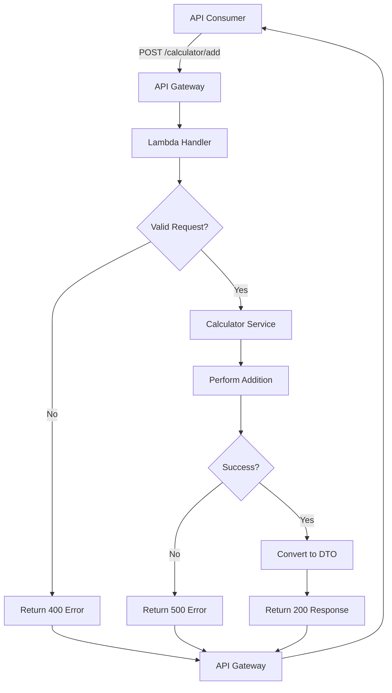
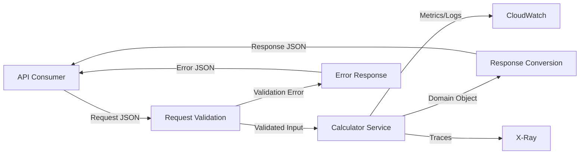

# Calculator API - Requirements Specification

**Date**: 2026-03-27
**Status**: Draft
**Version**: 1.0

---

## 1. Personas

### Persona: API Consumer
**Role**: External system or application consuming the Calculator API
**Goals**:
- Perform mathematical calculations without implementing calculation logic
- Receive fast, reliable calculation results
- Handle errors gracefully

**Key Needs**:
- Simple, predictable API interface
- Clear error messages
- Low latency responses

---

## 2. User Needs

### Persona: API Consumer
**Need**: Perform addition of two numbers via HTTP API
**Reason**: Offload calculation logic to a centralized, tested service

---

## 3. Functional Requirements

### FR-001: Addition Operation
**Description**: System must accept two numeric values and return their sum
**Persona**: API Consumer
**Priority**: Must

**Acceptance Criteria**:

**AC-001**: Given two positive integers, when addition is requested, then system returns correct sum
- Example: 5 + 3 = 8

**AC-002**: Given two negative integers, when addition is requested, then system returns correct sum
- Example: -5 + (-3) = -8

**AC-003**: Given one positive and one negative integer, when addition is requested, then system returns correct sum
- Example: 5 + (-3) = 2

**AC-004**: Given two floating-point numbers, when addition is requested, then system returns correct sum with decimal precision
- Example: 5.5 + 3.2 = 8.7

**AC-005**: Given zero as one operand, when addition is requested, then system returns the other operand
- Example: 0 + 5 = 5

---

### FR-002: Request Validation
**Description**: System must validate input parameters before performing calculation
**Persona**: API Consumer
**Priority**: Must

**Acceptance Criteria**:

**AC-006**: Given missing operand, when addition is requested, then system returns 400 Bad Request with error details

**AC-007**: Given non-numeric operand, when addition is requested, then system returns 400 Bad Request with error details

**AC-008**: Given null operand, when addition is requested, then system returns 400 Bad Request with error details

---

### FR-003: Response Format
**Description**: System must return calculation results in structured JSON format
**Persona**: API Consumer
**Priority**: Must

**Acceptance Criteria**:

**AC-009**: Given valid request, when calculation completes, then response includes result, operands, operation, and timestamp

**AC-010**: Given any request, when response is returned, then Content-Type is application/json

---

### FR-004: Error Handling
**Description**: System must return structured error responses for all failure scenarios
**Persona**: API Consumer
**Priority**: Must

**Acceptance Criteria**:

**AC-011**: Given validation error, when request fails, then response includes errorCode, message, and correlationId

**AC-012**: Given internal error, when request fails, then system returns 500 status with generic error message (no sensitive data)

---

## 4. Technical Requirements

### TR-001: API Latency
**Requirement**: API response time must be < 100ms at p95
**Measurement**: CloudWatch metrics
**Priority**: Must

### TR-002: HTTP Method
**Requirement**: API must accept POST requests with JSON body
**Rationale**: Standard RESTful pattern for operations with input
**Priority**: Must

### TR-003: Endpoint Path
**Requirement**: Endpoint must be accessible at POST /calculator/add
**Priority**: Must

### TR-004: Input Format
**Requirement**: Request body must be JSON with two numeric fields: "a" and "b"
**Example**:
```json
{
  "a": 5,
  "b": 3
}
```
**Priority**: Must

### TR-005: Response Format
**Requirement**: Response body must include operands, operation, result, and timestamp
**Example**:
```json
{
  "a": 5,
  "b": 3,
  "operation": "add",
  "result": 8,
  "timestamp": "2026-03-27T10:00:00.123456Z"
}
```
**Priority**: Must

### TR-006: Observability
**Requirement**: API must emit traces, metrics, and structured logs following OpenTelemetry standards
**Priority**: Must

### TR-007: Numeric Precision
**Requirement**: System must support floating-point numbers with standard IEEE 754 double precision
**Priority**: Must

### TR-008: Value Ranges
**Requirement**: System must support values from -1e308 to +1e308 (Python float range)
**Priority**: Must

---

## 5. Business Rules

### BR-001: Operand Validation
**Description**: Both operands must be numeric (int or float)
**Conditions**: Request received with operands
**Expected Outcome**: If non-numeric, return 400 with validation error

### BR-002: Required Fields
**Description**: Both "a" and "b" fields are required in request body
**Conditions**: Request received
**Expected Outcome**: If missing, return 400 with validation error

### BR-003: Result Precision
**Description**: Result must maintain precision for floating-point arithmetic
**Conditions**: Calculation performed on floating-point numbers
**Expected Outcome**: Return result with Python's native float precision (no rounding)

### BR-004: Timestamp Format
**Description**: Timestamp must be ISO 8601 format with timezone (UTC)
**Conditions**: Response generated
**Expected Outcome**: Timestamp field follows format "YYYY-MM-DDTHH:MM:SS.ffffffZ"

---

## 6. Domain Model

### Calculation (Domain Entity)
**Description**: Represents a mathematical calculation operation
**Key Attributes**:
- operand_a: First numeric value
- operand_b: Second numeric value
- operation: Type of calculation ("add")
- result: Calculated result
- timestamp: When calculation was performed

---

## 7. Actors

### Actor: API Consumer
**Type**: External System
**Interaction**: Sends HTTP POST requests to /calculator/add endpoint with JSON payload

### Actor: AWS API Gateway
**Type**: AWS Service
**Interaction**: Receives HTTP requests, routes to Lambda function, returns responses

### Actor: AWS Lambda
**Type**: AWS Service
**Interaction**: Executes calculation logic, returns results

### Actor: CloudWatch
**Type**: AWS Service
**Interaction**: Receives logs, metrics, and traces for observability

---

## 8. Workflows

### Workflow: Perform Addition
**Steps**:
1. API Consumer sends POST request to /calculator/add with JSON body containing "a" and "b"
2. API Gateway receives request and invokes Lambda function
3. Lambda handler extracts trace ID from headers
4. Handler validates request body (both fields present and numeric)
5. Handler delegates to Calculator Service
6. Service performs addition operation
7. Service returns domain object (Calculation)
8. Handler converts domain object to DTO
9. Handler returns HTTP 200 with JSON response
10. API Gateway returns response to consumer

### Workflow: Handle Validation Error
**Steps**:
1. API Consumer sends invalid request (missing field or non-numeric)
2. API Gateway receives request and invokes Lambda function
3. Lambda handler validates request body
4. Validation fails
5. Handler returns HTTP 400 with error response
6. API Gateway returns error response to consumer

### Workflow: Handle Internal Error
**Steps**:
1. API Consumer sends valid request
2. API Gateway receives request and invokes Lambda function
3. Lambda processing encounters unexpected exception
4. Middleware catches exception
5. Middleware logs error with full context
6. Middleware returns HTTP 500 with generic error response
7. API Gateway returns error response to consumer

---

## 9. Process Flow



---

## 10. Data Flow



---

## 11. Traceability Matrix

### Persona: API Consumer
↓
**User Need**: Perform addition of two numbers via HTTP API
↓
**FR-001**: System must accept two numeric values and return their sum
↓
**User Story**: As an API consumer, I want to add two numbers so that I can get the sum without implementing calculation logic
↓
**AC-001**: Given two positive integers, when addition is requested, then system returns correct sum

---

### Persona: API Consumer
↓
**User Need**: Receive clear error messages for invalid requests
↓
**FR-002**: System must validate input parameters before performing calculation
↓
**User Story**: As an API consumer, I want clear error messages so that I can fix invalid requests
↓
**AC-006**: Given missing operand, when addition is requested, then system returns 400 Bad Request with error details

---

## 12. Ambiguities Detected

### ⚠️ AMBIGUITY: Overflow Handling
**Issue**: Requirements don't specify behavior when result exceeds float range
**Suggested Clarification**:
- Option 1: Return error if result would overflow
- Option 2: Return Python's inf/-inf values
- **Assumption**: Use Python's native behavior (inf/-inf for overflow)

### ⚠️ AMBIGUITY: Concurrent Request Handling
**Issue**: Requirements don't specify expected concurrent request volume
**Suggested Clarification**: Define expected RPS (requests per second)
**Assumption**: Similar to Hello World API (~100 RPS)

### ⚠️ AMBIGUITY: Authentication
**Issue**: Requirements don't specify if API requires authentication
**Suggested Clarification**: Should API be public or require auth?
**Assumption**: Public API (no authentication required for initial implementation)

---

## 13. Non-Functional Requirements

### NFR-001: Availability
**Requirement**: API must have 99.9% uptime
**Measurement**: CloudWatch uptime metrics

### NFR-002: Scalability
**Requirement**: API must handle 100 concurrent requests
**Measurement**: Load testing

### NFR-003: Security
**Requirement**: API must not expose sensitive data in error messages
**Validation**: Error response review

### NFR-004: Monitoring
**Requirement**: All requests must emit structured logs with trace correlation
**Validation**: CloudWatch Logs Insights queries

---

## Summary

**Total Functional Requirements**: 4 (FR-001 to FR-004)
**Total Acceptance Criteria**: 12 (AC-001 to AC-012)
**Total Business Rules**: 4 (BR-001 to BR-004)
**Total Technical Requirements**: 8 (TR-001 to TR-008)
**Total Ambiguities Detected**: 3

**Next Steps**:
1. Review and approve requirements
2. Proceed to system design phase
3. Create detailed design document with architecture
