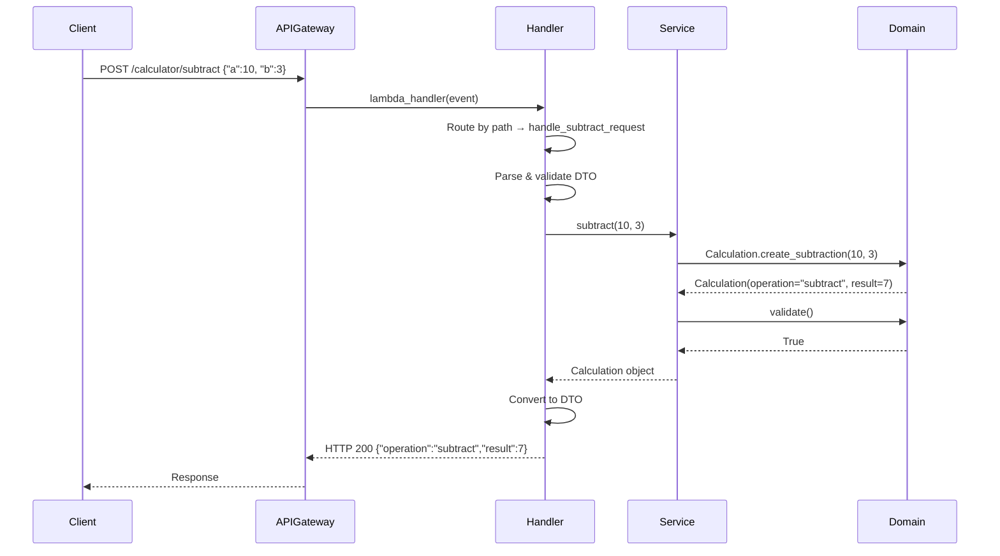
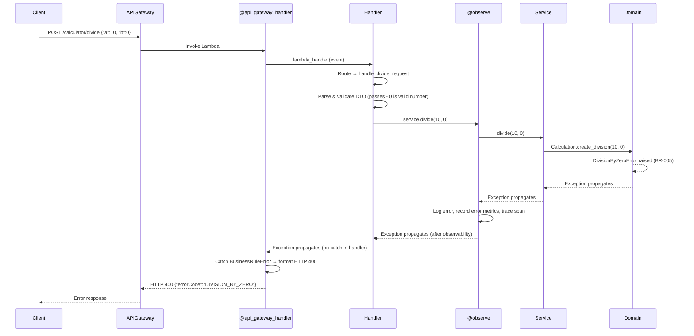

# Calculator Multi-Operator Enhancement - Application Design

**Date**: 2026-03-28
**Status**: Draft
**Version**: 1.0
**Based on**: multi-ops/requirements.md v1.0, calculator-app-design.md v1.0

---

## 1. Design Overview

### Architecture Pattern
**Clean Architecture** with **Aspect-Oriented Programming (AOP)** - unchanged from existing calculator design.

### Design Approach
Extend the existing calculator service with new operations while maintaining the established patterns. The key design decisions are:

1. **Extend domain entity** with new factory methods per operation (not separate entities)
2. **Extend service** with new methods per operation (not separate services)
3. **Add path-based routing** in handler to dispatch to correct operation
4. **Add custom domain exception** for division-by-zero (new error type)
5. **Reuse existing DTOs** - CalculatorRequest works for all operations, CalculatorResponse already supports dynamic operation field

### Layer Separation (Unchanged)
```
API Gateway → Handler (HTTP + Routing) → Service (Business Logic) → Domain (Pure Math)
                    ↓                        ↓                          ↓
                  DTO Layer             @observe decorator         Domain Objects
```

---

## 2. Design Decisions & Ambiguity Resolution

### Decision 5: Handler Routing Strategy

**Options Considered**:
1. **Single Lambda with path-based routing in handler** - handler inspects `event.path` to route
2. **Separate Lambda per operation** - dedicated Lambda function for each operation
3. **Separate handler functions per operation** - multiple `lambda_handler` functions

**Decision**: **Single Lambda with path-based routing in handler** (Option 1)

**Rationale**:
- Consistent with existing architecture (calculator already shares Lambda with hello-world)
- All operations share same dependencies, DTOs, and middleware
- Reduces cold start impact (one warm container serves all operations)
- CDK routes different API Gateway resources to same Lambda
- Handler remains thin - parses path, delegates to appropriate service method

**Implementation**:
```python
@api_gateway_handler
def lambda_handler(event, context, trace_id):
    path = event.get('path', '')
    if path.endswith('/subtract'):
        return handle_subtract_request(event)
    elif path.endswith('/multiply'):
        return handle_multiply_request(event)
    elif path.endswith('/divide'):
        return handle_divide_request(event)
    else:
        return handle_add_request(event)
```

### Decision 6: Division by Zero Error Handling

**Options Considered**:
1. **Custom domain exception** caught by handler layer (breaks AOP - handler gets try/catch)
2. **Custom domain exception** caught by shared middleware directly (couples middleware to calculator)
3. **Generic BusinessRuleError base class** in shared layer, domain defines specific errors, middleware catches base class generically

**Decision**: **Generic BusinessRuleError with domain-specific subclass** (Option 3)

**Rationale - Architecture-Driven Exception Flow**:

The exception follows the natural AOP propagation path through architecture layers:

```
Domain (raises)  →  Service (@observe logs/metrics/traces)  →  Handler (thin, no catch)  →  Middleware (@api_gateway_handler converts to HTTP 400)
```

Each layer does exactly its job:
- **Domain**: Declares the business rule violation by raising `DivisionByZeroError` - pure business logic, no logging or HTTP awareness
- **Service** (`@observe`): Exception propagates through the decorator which automatically logs the error, records error metrics, and creates a trace span with error status
- **Handler**: Stays thin with zero try/catch blocks - consistent with all other handler functions (AOP principle)
- **Middleware** (`@api_gateway_handler`): Catches the generic `BusinessRuleError` base class and converts to HTTP 400, reading `error_code` from the exception - no coupling to calculator-specific types

**Implementation**:
- New base class: `BusinessRuleError(Exception)` with `error_code: str` attribute in `backend/shared/exceptions/`
- Domain defines: `DivisionByZeroError(BusinessRuleError)` with `error_code="DIVISION_BY_ZERO"` in domain layer
- Middleware catches: `except BusinessRuleError as e:` → 400 with `e.error_code` - fully generic, works for any future service
- Handlers: **NOT modified** - no try/catch, consistent AOP pattern throughout

### Decision 7: Domain Validation Enhancement

**Options Considered**:
1. **Single validate() with operation dispatch** - one method, switch on operation type
2. **Operation-specific validate methods** - separate validate per operation
3. **Operation registry pattern** - map of operation -> validation function

**Decision**: **Single validate() with operation dispatch** (Option 1)

**Rationale**:
- Simple and readable for 4 operations
- Consistent with existing pattern
- Domain entity stays as single class (not over-engineered)
- Easy to extend: just add an elif branch

---

## 3. Domain Model Changes

### Calculation Entity (Enhanced)

**File**: `backend/lambdas/calculator/src/domain/calculation.py`

**Changes**:
- Add `DivisionByZeroError` custom exception class
- Add factory methods: `create_subtraction()`, `create_multiplication()`, `create_division()`
- Update `validate()` to support all four operation types

```python
# In backend/shared/exceptions/business_rule_error.py (NEW shared file)
class BusinessRuleError(Exception):
    """Base exception for business rule violations.

    All business rule errors inherit from this.
    Middleware catches this generically and returns HTTP 400.
    """
    error_code: str = "BUSINESS_RULE_ERROR"

    def __init__(self, message: str, error_code: str = None):
        super().__init__(message)
        if error_code:
            self.error_code = error_code


# In domain/calculation.py
from shared.exceptions.business_rule_error import BusinessRuleError

class DivisionByZeroError(BusinessRuleError):
    """Raised when division by zero is attempted.

    Business Rule BR-005: Division by zero must be rejected.
    """
    def __init__(self, message: str = "Division by zero is not allowed"):
        super().__init__(message, error_code="DIVISION_BY_ZERO")


VALID_OPERATIONS = {"add", "subtract", "multiply", "divide"}

# Operation -> (computation_function) mapping for validation
OPERATION_VALIDATORS = {
    "add": lambda a, b: a + b,
    "subtract": lambda a, b: a - b,
    "multiply": lambda a, b: a * b,
    "divide": lambda a, b: a / b,
}


@dataclass(frozen=True)
class Calculation:
    operand_a: float
    operand_b: float
    operation: str
    result: float
    timestamp: datetime

    @classmethod
    def create_addition(cls, a: float, b: float) -> "Calculation":
        """Factory method for addition. (Unchanged)"""
        return cls(operand_a=a, operand_b=b, operation="add",
                   result=a + b, timestamp=datetime.now(timezone.utc))

    @classmethod
    def create_subtraction(cls, a: float, b: float) -> "Calculation":
        """Factory method for subtraction (FR-005, BR-006)."""
        return cls(operand_a=a, operand_b=b, operation="subtract",
                   result=a - b, timestamp=datetime.now(timezone.utc))

    @classmethod
    def create_multiplication(cls, a: float, b: float) -> "Calculation":
        """Factory method for multiplication (FR-006)."""
        return cls(operand_a=a, operand_b=b, operation="multiply",
                   result=a * b, timestamp=datetime.now(timezone.utc))

    @classmethod
    def create_division(cls, a: float, b: float) -> "Calculation":
        """Factory method for division (FR-007, BR-005, BR-007).

        Raises:
            DivisionByZeroError: If b is zero (BR-005)
        """
        if b == 0:
            raise DivisionByZeroError("Division by zero is not allowed")
        return cls(operand_a=a, operand_b=b, operation="divide",
                   result=a / b, timestamp=datetime.now(timezone.utc))

    def validate(self) -> bool:
        """Validate calculation consistency for any operation type."""
        if self.operation not in VALID_OPERATIONS:
            raise ValueError(f"Unknown operation: {self.operation}")

        expected = OPERATION_VALIDATORS[self.operation](self.operand_a, self.operand_b)
        tolerance = 1e-10
        if abs(self.result - expected) > tolerance:
            raise ValueError(
                f"Calculation result is incorrect. Expected {expected}, got {self.result}"
            )

        if self.timestamp.tzinfo is None:
            raise ValueError("Timestamp must be timezone-aware")

        return True
```

---

## 4. Service Layer Changes

### CalculatorService (Enhanced)

**File**: `backend/lambdas/calculator/src/services/calculator_service.py`

**Changes**: Add `subtract()`, `multiply()`, `divide()` methods with `@observe` decorators.

```python
class CalculatorService:

    @observe(operation="add_numbers", metric_prefix="calculator_add")
    def add(self, a: float, b: float) -> Calculation:
        """Existing - unchanged."""
        calculation = Calculation.create_addition(a, b)
        calculation.validate()
        return calculation

    @observe(operation="subtract_numbers", metric_prefix="calculator_subtract")
    def subtract(self, a: float, b: float) -> Calculation:
        """Perform subtraction (FR-005, BR-006).
        Returns domain object with operation='subtract'.
        """
        calculation = Calculation.create_subtraction(a, b)
        calculation.validate()
        return calculation

    @observe(operation="multiply_numbers", metric_prefix="calculator_multiply")
    def multiply(self, a: float, b: float) -> Calculation:
        """Perform multiplication (FR-006).
        Returns domain object with operation='multiply'.
        """
        calculation = Calculation.create_multiplication(a, b)
        calculation.validate()
        return calculation

    @observe(operation="divide_numbers", metric_prefix="calculator_divide")
    def divide(self, a: float, b: float) -> Calculation:
        """Perform division (FR-007, BR-005, BR-007).
        Raises DivisionByZeroError if b == 0.
        Returns domain object with operation='divide'.
        """
        calculation = Calculation.create_division(a, b)
        calculation.validate()
        return calculation
```

**Observability per operation** (TR-013):
| Method | Operation Name | Metric Prefix | Span Name |
|--------|---------------|---------------|-----------|
| add | add_numbers | calculator_add | add_numbers |
| subtract | subtract_numbers | calculator_subtract | subtract_numbers |
| multiply | multiply_numbers | calculator_multiply | multiply_numbers |
| divide | divide_numbers | calculator_divide | divide_numbers |

---

## 5. Handler Layer Changes

### CalculatorHandler (Enhanced)

**File**: `backend/lambdas/calculator/src/handlers/calculator_handler.py`

**Changes**: Add path-based routing and new handler functions.

```python
_calculator_service = CalculatorService()


@api_gateway_handler
def lambda_handler(event: dict, context: Any, trace_id: str) -> dict:
    """Lambda entry point - routes to appropriate operation handler."""
    path = event.get('path', '')

    if path.endswith('/subtract'):
        return handle_subtract_request(event)
    elif path.endswith('/multiply'):
        return handle_multiply_request(event)
    elif path.endswith('/divide'):
        return handle_divide_request(event)
    else:
        return handle_add_request(event)


def handle_add_request(event: dict) -> dict:
    """Handle POST /calculator/add. (Unchanged)"""
    body = json.loads(event.get('body', '{}'))
    request_dto = CalculatorRequest(**body)
    calculation = _calculator_service.add(request_dto.a, request_dto.b)
    response_dto = CalculatorResponse.from_calculation(calculation)
    return response_dto.to_dict()


def handle_subtract_request(event: dict) -> dict:
    """Handle POST /calculator/subtract (FR-005)."""
    body = json.loads(event.get('body', '{}'))
    request_dto = CalculatorRequest(**body)
    calculation = _calculator_service.subtract(request_dto.a, request_dto.b)
    response_dto = CalculatorResponse.from_calculation(calculation)
    return response_dto.to_dict()


def handle_multiply_request(event: dict) -> dict:
    """Handle POST /calculator/multiply (FR-006)."""
    body = json.loads(event.get('body', '{}'))
    request_dto = CalculatorRequest(**body)
    calculation = _calculator_service.multiply(request_dto.a, request_dto.b)
    response_dto = CalculatorResponse.from_calculation(calculation)
    return response_dto.to_dict()


def handle_divide_request(event: dict) -> dict:
    """Handle POST /calculator/divide (FR-007).

    DivisionByZeroError propagation path:
    Domain (raises) → Service (@observe logs/metrics) → Handler (no catch) → Middleware (HTTP 400)
    """
    body = json.loads(event.get('body', '{}'))
    request_dto = CalculatorRequest(**body)
    calculation = _calculator_service.divide(request_dto.a, request_dto.b)
    response_dto = CalculatorResponse.from_calculation(calculation)
    return response_dto.to_dict()
```

---

## 6. DTO Layer Changes

### CalculatorRequest - No Changes
The existing `CalculatorRequest` with fields `a` and `b` works for all operations (TR-014).

### CalculatorResponse - No Changes
The existing `CalculatorResponse.from_calculation()` already reads `calc.operation` dynamically, so it will correctly produce `"operation": "subtract"`, `"multiply"`, or `"divide"`.

### ErrorResponse Enhancement

**File**: `backend/lambdas/calculator/src/dto/response.py`

**Changes**: Add generic factory method for business rule errors (not calculator-specific).

```python
class ErrorResponse(BaseModel):
    # ... existing fields ...

    @classmethod
    def create_business_rule_error(cls, correlation_id: str, error_code: str, message: str) -> "ErrorResponse":
        """Create error response for any business rule violation.

        Generic factory - works for DivisionByZeroError or any future BusinessRuleError subclass.
        The error_code and message come from the exception itself.
        """
        return cls(
            errorCode=error_code,
            message=message,
            correlationId=correlation_id,
            timestamp=datetime.now(timezone.utc).strftime("%Y-%m-%dT%H:%M:%S.%fZ")
        )
```

---

## 7. Middleware Enhancement

### api_gateway_handler Updates

**File**: `backend/shared/middleware/api_gateway.py`

**Changes**: Add generic `BusinessRuleError` catch block between `ValidationError` and `Exception`. The middleware imports **only** the shared base class - no coupling to any service-specific exception.

```python
from shared.exceptions.business_rule_error import BusinessRuleError

# Exception handling order (CRITICAL):
try:
    result = func(event, context, trace_id)
    return format_response(result)
except ValidationError as e:           # 1st: Pydantic validation → 400 VALIDATION_ERROR
    return format_400_validation_response(e, trace_id)
except BusinessRuleError as e:         # 2nd: Any business rule violation → 400 with e.error_code
    error_response = ErrorResponse.create_business_rule_error(trace_id, e.error_code, str(e))
    return {
        'statusCode': 400,
        'headers': {'Content-Type': 'application/json', 'X-Trace-Id': trace_id},
        'body': json.dumps(error_response.to_dict())
    }
except Exception as e:                 # 3rd: Everything else → 500
    return format_500_response(e, trace_id)
```

**Key**: The middleware catches `BusinessRuleError` (shared base class) generically. It reads `e.error_code` to populate the response. Any future service can define its own `BusinessRuleError` subclass and get 400 handling automatically - zero middleware changes needed.

### New Shared File

**File**: `backend/shared/exceptions/business_rule_error.py` (NEW)

Single base class for all business rule violations across the platform.

---

## 8. Error Handling Strategy (Updated)

### Exception Hierarchy
```
                          Exception
                              |
              ┌───────────────┼───────────────┐
        ValidationError  BusinessRuleError  ValueError
         (pydantic)         (shared)        (domain)
              |                 |
              |         DivisionByZeroError
              |           (calculator domain)
              |
         HTTP 400          HTTP 400           HTTP 500
      VALIDATION_ERROR  DIVISION_BY_ZERO   INTERNAL_ERROR
```

### AOP Exception Propagation Flow
```
Domain raises → @observe logs/metrics/traces → Handler (no catch) → @api_gateway_handler converts to HTTP
```

**Key Design Choices**:
- `BusinessRuleError` is a **shared platform concept** - any service can define subclasses
- `DivisionByZeroError` is a **domain-specific** subclass with `error_code="DIVISION_BY_ZERO"`
- Middleware catches the **generic base class** - no service-specific imports
- `@observe` automatically observes the error (logging, metrics, tracing) as it propagates through the service layer
- Handlers have **zero** try/catch blocks - fully consistent AOP pattern

---

## 9. Observability Design (Updated)

### New Metrics (TR-013)

| Metric | Type | Description |
|--------|------|-------------|
| `calculator_subtract_total` | Counter | Subtraction operation count |
| `calculator_subtract_duration` | Histogram | Subtraction latency (ms) |
| `calculator_multiply_total` | Counter | Multiplication operation count |
| `calculator_multiply_duration` | Histogram | Multiplication latency (ms) |
| `calculator_divide_total` | Counter | Division operation count |
| `calculator_divide_duration` | Histogram | Division latency (ms) |

All metrics automatically emitted by `@observe` decorator with per-operation metric prefixes.

### New Tracing Spans

| Span Name | Service Method | Attributes |
|-----------|---------------|------------|
| subtract_numbers | subtract() | operand.a, operand.b, result |
| multiply_numbers | multiply() | operand.a, operand.b, result |
| divide_numbers | divide() | operand.a, operand.b, result |

---

## 10. Sequence Diagrams

### Happy Path: Subtraction/Multiplication (Generic)



### Error Path: Division by Zero (AOP Propagation)



---

## 11. Files Changed Summary

| File | Change Type | Description |
|------|------------|-------------|
| `shared/exceptions/business_rule_error.py` | **CREATE** | Generic BusinessRuleError base class (shared platform concept) |
| `shared/exceptions/__init__.py` | **CREATE** | Package init |
| `shared/middleware/api_gateway.py` | MODIFY | Add generic BusinessRuleError catch (no service-specific imports) |
| `src/domain/calculation.py` | MODIFY | Add DivisionByZeroError(BusinessRuleError), 3 factory methods, update validate() |
| `src/services/calculator_service.py` | MODIFY | Add subtract(), multiply(), divide() with @observe |
| `src/handlers/calculator_handler.py` | MODIFY | Add path routing, 3 new handler functions (no try/catch) |
| `src/dto/response.py` | MODIFY | Add create_business_rule_error() generic factory |
| `tests/unit/test_calculation_domain.py` | MODIFY | Add tests for new factory methods + validation |
| `tests/unit/test_calculator_service.py` | MODIFY | Add tests for subtract/multiply/divide |
| `tests/unit/test_calculator_handler.py` | MODIFY | Add tests for routing + new operations |
| `tests/unit/test_dto.py` | MODIFY | Add tests for business rule error response |
| `tests/conftest.py` | MODIFY | Add fixtures for new operations |
| `tests/integration/test_api_integration.py` | MODIFY | Add integration tests for new endpoints |

**Files to create**: 2 (shared BusinessRuleError base class + __init__)
**Files to modify**: 11

---

## 12. Acceptance Criteria Mapping

| AC ID | Requirement | Implementation | Test File |
|-------|-------------|---------------|-----------|
| AC-013 | FR-005 | Domain.create_subtraction + Service.subtract | test_calculation_domain.py |
| AC-014 | FR-005 | Domain.create_subtraction + Service.subtract | test_calculation_domain.py |
| AC-015 | FR-005 | Domain.create_subtraction + Service.subtract | test_calculation_domain.py |
| AC-016 | FR-005 | Domain.create_subtraction + Service.subtract | test_calculation_domain.py |
| AC-017 | FR-005 | Domain.create_subtraction + Service.subtract | test_calculation_domain.py |
| AC-018 | FR-006 | Domain.create_multiplication + Service.multiply | test_calculation_domain.py |
| AC-019 | FR-006 | Domain.create_multiplication + Service.multiply | test_calculation_domain.py |
| AC-020 | FR-006 | Domain.create_multiplication + Service.multiply | test_calculation_domain.py |
| AC-021 | FR-006 | Domain.create_multiplication + Service.multiply | test_calculation_domain.py |
| AC-022 | FR-006 | Domain.create_multiplication + Service.multiply | test_calculation_domain.py |
| AC-023 | FR-007 | Domain.create_division + Service.divide | test_calculation_domain.py |
| AC-024 | FR-007 | Domain.create_division + Service.divide | test_calculation_domain.py |
| AC-025 | FR-007 | Domain.create_division + Service.divide | test_calculation_domain.py |
| AC-026 | FR-007 | Domain.create_division + Service.divide | test_calculation_domain.py |
| AC-027 | FR-007 | Domain.create_division + Service.divide | test_calculation_domain.py |
| AC-028 | FR-008 | DivisionByZeroError + middleware | test_calculator_handler.py |
| AC-029 | FR-008 | ErrorResponse.create_division_by_zero_error | test_calculator_handler.py |
| AC-030 | FR-009 | CalculatorResponse.from_calculation | test_calculator_handler.py |
| AC-031 | FR-009 | CalculatorResponse.from_calculation | test_calculator_handler.py |
| AC-032 | FR-009 | CalculatorResponse.from_calculation | test_calculator_handler.py |
| AC-033 | FR-010 | CalculatorRequest DTO validation | test_calculator_handler.py |
| AC-034 | FR-010 | CalculatorRequest DTO validation | test_calculator_handler.py |
| AC-035 | FR-010 | CalculatorRequest DTO validation | test_calculator_handler.py |

---

## 13. Design Review Checklist

- [x] Clean Architecture with layer separation maintained
- [x] Domain objects are pure and immutable (frozen dataclass)
- [x] Service layer returns domain objects, not DTOs
- [x] Handler converts domain to DTO (thin handler)
- [x] AOP decorators for cross-cutting concerns (@observe per operation)
- [x] Pydantic validation for request DTOs (reused)
- [x] Structured error responses (existing + DivisionByZeroError)
- [x] OpenTelemetry observability (per-operation metrics via TR-013)
- [x] Reuses existing middleware patterns
- [x] All 23 new acceptance criteria mapped to implementation
- [x] Test strategy covers all layers
- [x] No new files needed - modifications only
- [x] Division by zero handled as domain business rule
- [x] Consistent response format across all operations (FR-009)
