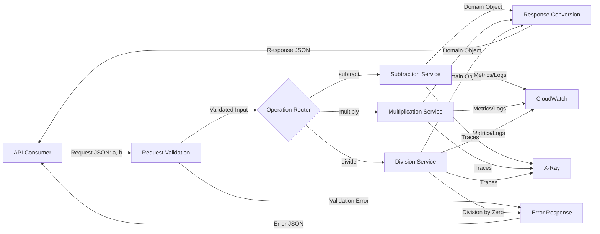

# Calculator Multi-Operator Enhancement - Data Flows

**Date**: 2026-03-28

---

## Data Flow Diagram

```mermaid
graph LR
    A[API Consumer] -->|Request JSON: a, b| B[Request Validation]
    B -->|Validated Input| C{Operation Router}
    C -->|subtract| D[Subtraction Service]
    C -->|multiply| E[Multiplication Service]
    C -->|divide| F[Division Service]

    D -->|Domain Object| G[Response Conversion]
    E -->|Domain Object| G
    F -->|Domain Object| G
    G -->|Response JSON| A

    B -->|Validation Error| H[Error Response]
    F -->|Division by Zero| H
    H -->|Error JSON| A

    D -->|Metrics/Logs| I[CloudWatch]
    E -->|Metrics/Logs| I
    F -->|Metrics/Logs| I
    D -->|Traces| J[X-Ray]
    E -->|Traces| J
    F -->|Traces| J
```
