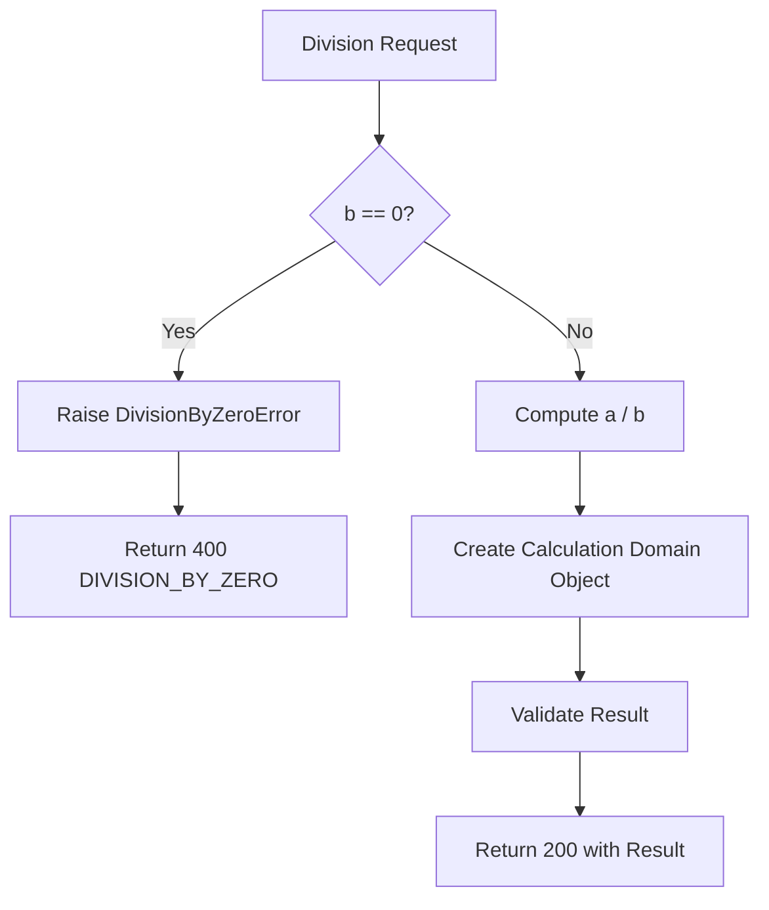

# Calculator Multi-Operator Enhancement - Process Flows

**Date**: 2026-03-28

---

## Multi-Operation Process Flow

```mermaid
flowchart TD
    A[API Consumer] -->|POST /calculator/{operation}| B[API Gateway]
    B --> C[Lambda Handler]
    C --> D{Valid Request?}
    D -->|No| E[Return 400 Validation Error]
    D -->|Yes| F{Which Operation?}
    F -->|subtract| G[Calculator Service: Subtract]
    F -->|multiply| H[Calculator Service: Multiply]
    F -->|divide| I{Divisor = 0?}
    I -->|Yes| J[Return 400 Division by Zero]
    I -->|No| K[Calculator Service: Divide]
    G --> L[Create Domain Object]
    H --> L
    K --> L
    L --> M[Convert to DTO]
    M --> N[Return 200 Response]
    E --> O[API Gateway]
    J --> O
    N --> O
    O --> A
```

## Division-Specific Flow


