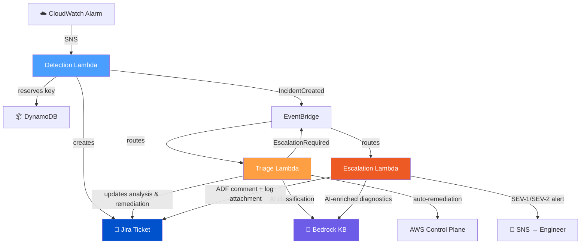
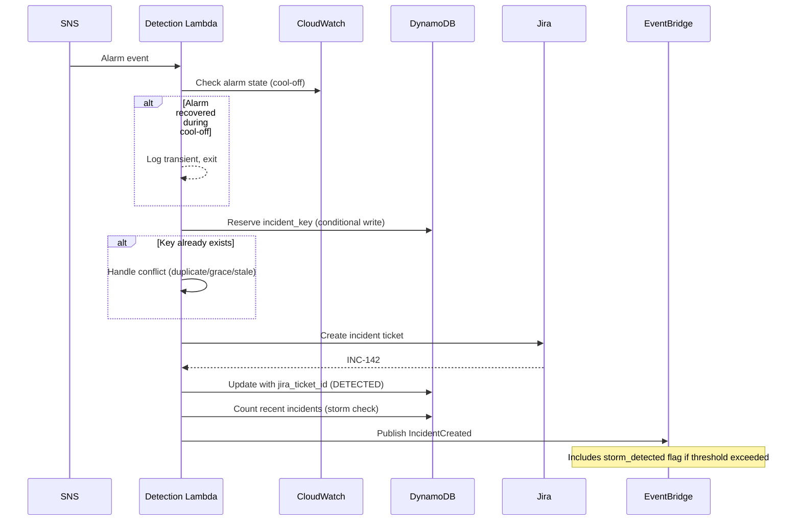
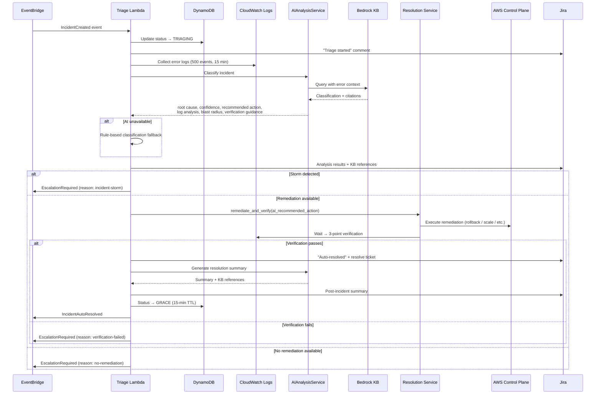
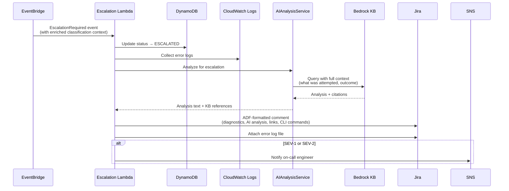
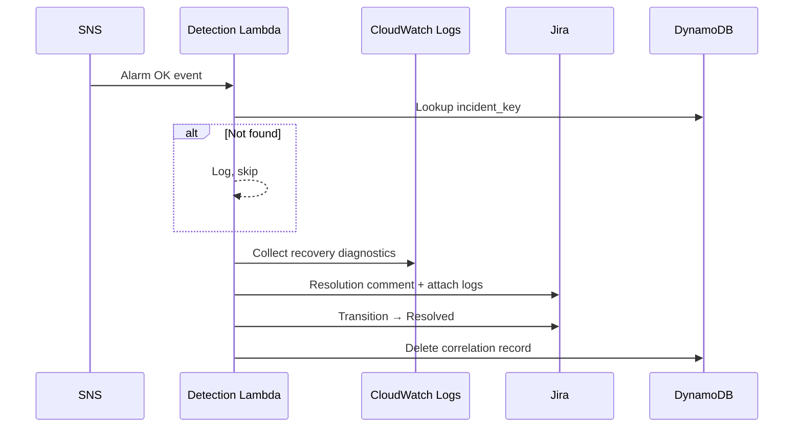
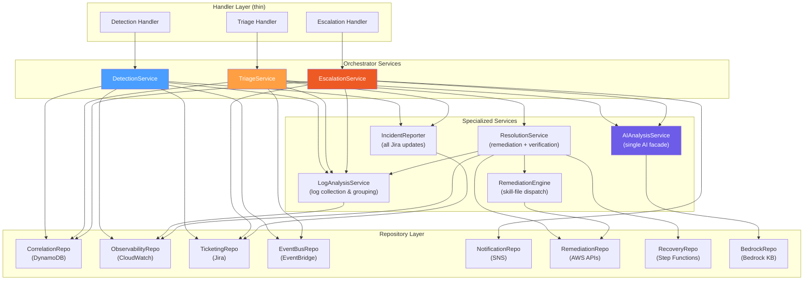
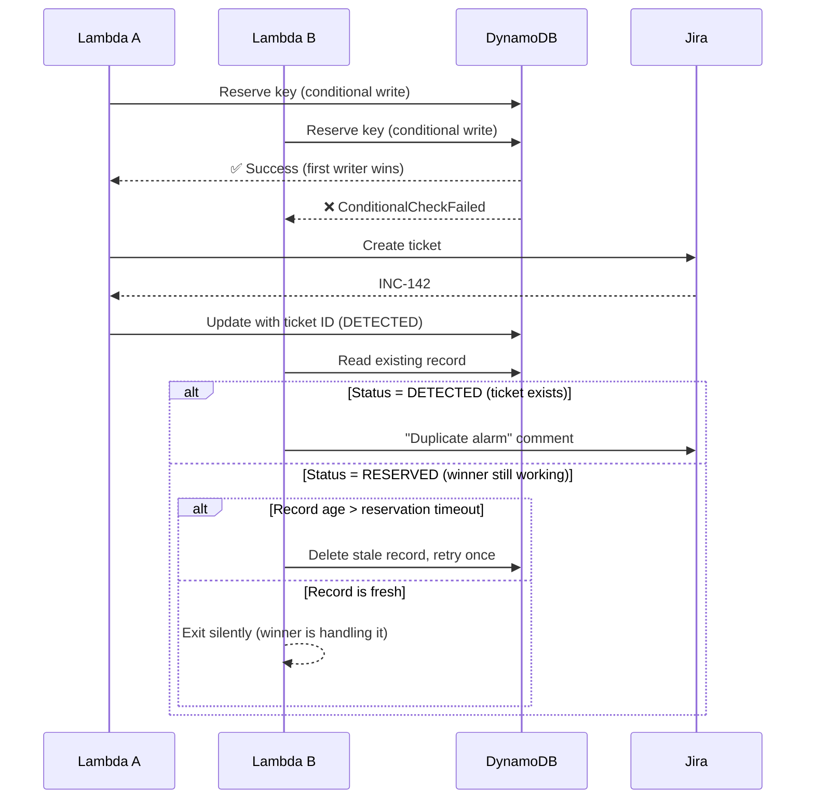
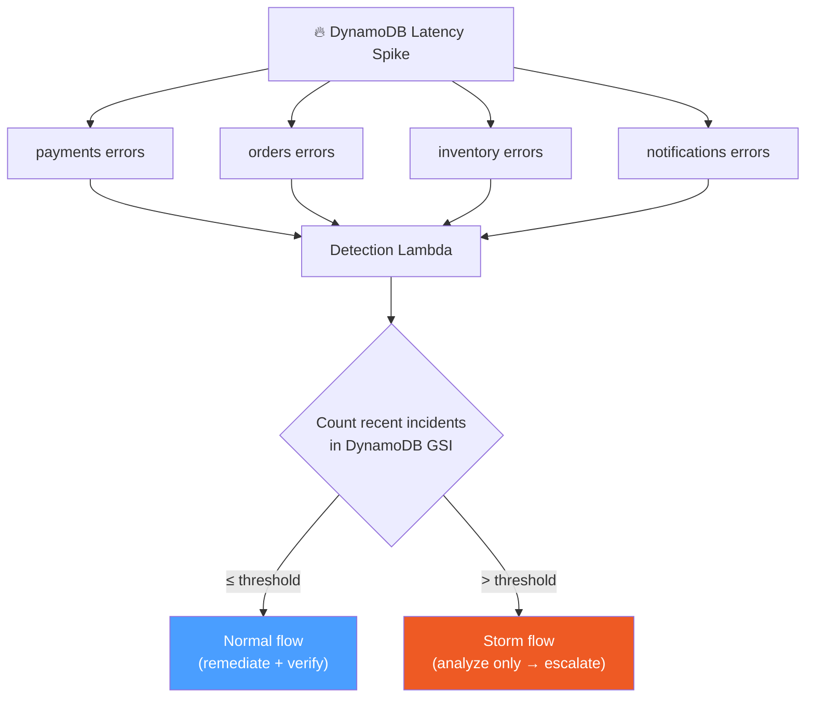
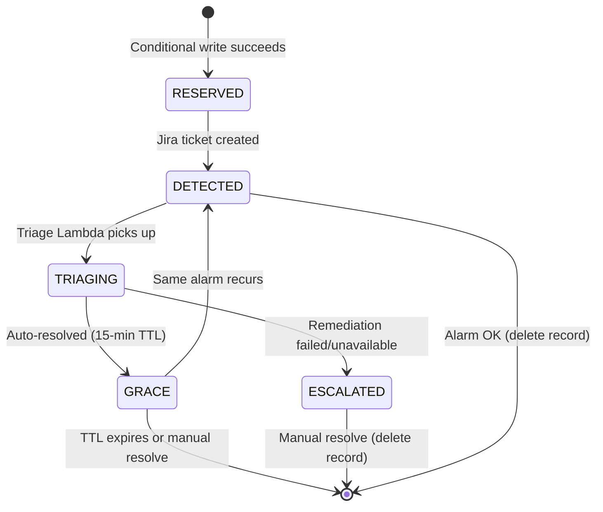

# Incident Management Pipeline — Application Design

## Design Context

This design implements the requirements in `requirements.md` following the principles in `design-principles.md`. It prioritizes clear flow, small components, minimal abstraction, and explicit state.

Unlike the calculator/hello-world Lambdas (API Gateway → Lambda), the incident manager is **event-driven**. There is no HTTP request/response cycle. The pipeline reacts to CloudWatch alarms delivered via SNS and orchestrates incident lifecycle through EventBridge events.

### System Responsibilities

| System | Role |
|--------|------|
| CloudWatch | Detects failure (alarms) |
| SNS | Delivers alarm events to Detection Lambda |
| EventBridge | Routes lifecycle events between Lambdas |
| Lambda (×3) | Processing logic — one per pipeline leg |
| Jira | System of record — full incident history, diagnostics, resolution |
| DynamoDB | Correlation store — maps incident keys to Jira tickets; idempotency |
| Bedrock KB | AI-powered classification, analysis, and summarization |

### Key Architectural Decisions

- **Jira is the system of record** — owns full incident lifecycle, diagnostics, and history
- **DynamoDB is minimal** — only correlation (incident_key → jira_ticket_id) and idempotency
- **3 independent Lambdas** for failure isolation, scoped IAM, and independent scaling
- **Single AI facade** — all Bedrock interactions consolidated in `AIAnalysisService`; swap this one class to change AI provider
- **Agent-ready service decomposition** — 7 specialized services with clear I/O contracts

---

## 1. Pipeline Architecture



### Why 3 Lambdas?

| Concern | 3-Lambda Design |
|---------|----------------|
| Failure isolation | Each leg fails independently — escalation works even if triage crashes |
| Timeout tuning | Detection: 180s (cool-off sleep), Triage: 300s (verification wait), Escalation: 30s |
| IAM scope | Least-privilege per Lambda — Detection writes DynamoDB; Escalation reads only |
| Complexity | Each handler does one thing well |
| Scalability | Tuned memory/concurrency per leg |

---

## 2. Correlation Model

The **incident key** is the thread that links every system together:

```
Alarm name:   {service}-{high|low}-{alarm_type}-{stage}
                         ↓ strip threshold direction
Incident key: {service}-{alarm_type}-{stage}
```

| System | What It Stores |
|--------|---------------|
| CloudWatch | Alarm name (naming convention) |
| DynamoDB | `incident_key` as partition key → `jira_ticket_id` |
| Jira | `incident_key` as custom field on ticket |
| EventBridge | `incident_key` in every event payload |

**Examples**: `payments-error-rate-prod`, `calculator-throttle-prod`, `orders-latency-dev`

---

## 3. Processing Flows

### 3.1 Detection Flow — Alarm → Incident



### 3.2 Triage Flow — Analyze → Remediate → Resolve



### 3.3 Escalation Flow — Enrich → Notify



### 3.4 Recovery Flow — Alarm OK → Resolve



---

## 4. Service Architecture

The service layer follows **hexagonal architecture** — orchestrators manage workflow, specialized services handle capabilities, and repositories abstract external systems.



### Orchestrators vs Specialized Services

| Role | Services | Responsibility |
|------|----------|---------------|
| **Orchestrators** | Detection, Triage, Escalation | Manage workflow state, decide WHAT happens, delegate HOW |
| **AI Facade** | AIAnalysisService | ALL Bedrock interactions — classification, escalation analysis, resolution summary. Owns prompts, response parsing, citation extraction |
| **Log Operations** | LogAnalysisService | Error collection, log grouping, health checks. Wraps CloudWatch — used by all 3 orchestrators |
| **Resolution** | ResolutionService + RemediationEngine | Auto-remediation execution, 3-point verification, recovery workflow triggers |
| **Reporting** | IncidentReporter | ALL Jira ticket updates — comments, attachments, transitions. Orchestrators pass results, reporter formats and posts |

### Key Constraint: No AI Logic in Orchestrators

`AIAnalysisService` is the **only** class that knows about Bedrock, prompts, and response parsing. Orchestrators call structured methods and receive domain results. To swap AI providers, replace this one class — zero changes to services.

---

## 5. AI Integration Architecture

```mermaid
graph LR
    subgraph Services ["Services (domain language)"]
        TS["TriageService"]
        ES["EscalationService"]
    end

    subgraph AI ["AIAnalysisService (single facade)"]
        CL["classify_incident()"]
        AN["analyze_for_escalation()"]
        GR["generate_resolution_summary()"]
        PR["Prompt Templates<br/>(3 files in src/prompts/)"]
        EX["Citation Extraction<br/>(KB references → Jira)"]
    end

    subgraph Bedrock ["Amazon Bedrock"]
        KB["Knowledge Base<br/>(runbook chunks)"]
        LLM["Foundation Model<br/>(Claude)"]
    end

    TS -->|error data, service context| CL
    CL -->|classification, confidence,<br/>recommended action, blast radius,<br/>verification guidance, KB references| TS

    TS -->|post-resolution context| GR
    GR -->|summary text + KB references| TS

    ES -->|full remediation context| AN
    AN -->|analysis text + KB references| ES

    CL & AN & GR --> PR
    CL & AN & GR --> KB
    KB --> LLM
    LLM -->|response + citations| EX
    EX -->|deduplicated references<br/>(source URI + matched content)| CL & AN & GR
```

### AI Methods

| Method | Called By | Input | Output |
|--------|----------|-------|--------|
| `classify_incident` | Triage | Error data, service type, alarm type, stage | Classification, confidence, recommended action, automation level, log analysis, blast radius, verification guidance, KB references |
| `analyze_for_escalation` | Escalation | Error logs, full remediation context (what was tried, outcome) | Analysis text for engineer handoff, KB references |
| `generate_resolution_summary` | Triage | Resolution context (root cause, action taken, recovery model) | Post-incident summary, KB references |

### Graceful Degradation

All AI methods return `None` on failure. Services fall back gracefully:
- **Classification**: rule-based pattern matching from externalized config
- **Escalation analysis**: Jira comment omits AI section, includes raw diagnostics only
- **Resolution summary**: skipped — ticket still resolves normally

### KB Citation Tracking

Every AI response captures `retrievedReferences` from Bedrock — the source runbook URIs and matched content used for generation. These flow through to Jira comments for full traceability (engineers can see which runbook sections informed the AI's analysis).

---

## 6. Key Design Patterns

### 6.1 Race Condition Protection — Reserve-Then-Create

Two alarms can trigger simultaneously. A two-phase DynamoDB write prevents duplicate Jira tickets:



### 6.2 Incident Storm Detection

When a shared dependency fails, many services alarm simultaneously. Without protection, automation acts on the wrong systems (rolling back services when the root cause is a shared database).



**Normal flow**: Alarm → Detection → Triage → Remediation → Verify → Resolve

**Storm flow**: Alarm → Detection → Triage (analysis only, no automation) → Escalate immediately

Engineers still get full diagnostics during storms — storm detection disables automation, not analysis.

### 6.3 Grace Period — Recurrence Detection

After auto-resolution, the DynamoDB record transitions to `GRACE` status with a 15-minute TTL. If the same alarm fires again within this window:

1. Detection skips cool-off (the problem is confirmed recurring)
2. No new Jira ticket — reopens the existing one
3. Escalates immediately (reason: `grace-period-recurrence`)
4. DynamoDB record resets to `DETECTED` with fresh 24h TTL

This prevents the system from endlessly auto-remediating a flapping alarm.

### 6.4 AI-Recommended Action Flow

When `AIAnalysisService` classifies an incident, it can recommend a specific remediation action from the runbooks. This flows through the pipeline:

```
AIAnalysisService.classify_incident()
  → returns {recommended_action: "lambda-version-rollback", automation_level: "auto"}

TriageService passes ai_recommended_action to ResolutionService
  → ResolutionService passes to RemediationEngine

RemediationEngine.attempt():
  1. AI action provided? → look up in skill file → if valid method exists → use it
  2. Otherwise → fall back to remediation catalog lookup
```

**Safety**: The skill file's `actions` dict is the allowlist. Only pre-defined actions with valid repository methods execute — the AI cannot invent arbitrary actions.

---

## 7. Data Model

### 7.1 Correlation Record (DynamoDB)

| Attribute | Type | Purpose |
|-----------|------|---------|
| `incident_key` | String (PK) | `{service}-{alarm_type}-{stage}` |
| `jira_ticket_id` | String | Jira ticket key (e.g., `INC-142`) |
| `severity` | String | SEV-1, SEV-2, SEV-3 |
| `status` | String | RESERVED → DETECTED → TRIAGING → ESCALATED or GRACE |
| `created_at` | ISO 8601 | Incident creation time |
| `ttl` | Epoch | Auto-cleanup: 24h for active records, 15min for GRACE |

**GSI**: `created_at-index` — enables time-range count queries for storm detection. Uses fixed partition key `"ALL"` (acceptable hot partition at incident volumes <100/day).

### 7.2 Alarm Event (Input)

Parsed from SNS CloudWatch Alarm messages. Derives:
- `incident_key` from alarm name convention
- `severity` and `recovery_model` from externalized severity mapping
- `service_type` from CloudWatch namespace (Lambda, API Gateway, OpenSearch)

### 7.3 Status Lifecycle



### 7.4 Key Enums

| Enum | Values | Used For |
|------|--------|----------|
| CorrelationStatus | RESERVED, DETECTED, TRIAGING, ESCALATED, GRACE | DynamoDB record lifecycle |
| Severity | SEV-1, SEV-2, SEV-3 | Routing, notification, timing |
| RecoveryModel | stateless, replay, reprocess, data-correction, backlog-drain | Post-resolution recovery strategy |
| ResolutionOutcome | success, no-remediation, remediation-failed, verification-failed | Triage decision routing |
| EscalationReason | verification-failed, no-remediation, remediation-failed, incident-storm, grace-period-recurrence, triage-timeout | EscalationRequired event reason |

### 7.5 Recovery Models

Restoring infrastructure doesn't always restore system correctness. The recovery model classifies what needs to happen *after* the service is back:

| Model | When | Recovery Action |
|-------|------|----------------|
| stateless | Service just needs to be running | No further action |
| replay | Messages were lost during outage | Replay from DLQ |
| reprocess | Batch jobs or ETL failed mid-run | Rerun failed jobs |
| data-correction | Data integrity compromised | Reconciliation workflow |
| backlog-drain | Queue accumulated during outage | Scale consumers temporarily |

The incident system orchestrates recovery workflows but **never processes business data itself**.

---

## 8. Event Contracts

### 8.1 Event Types

| Event | Publisher | Consumer | Trigger |
|-------|-----------|----------|---------|
| `IncidentCreated` | Detection | Triage | New incident needs analysis |
| `EscalationRequired` | Triage | Escalation | Self-healing failed or unavailable |
| `IncidentAutoResolved` | Triage | (audit trail) | Self-healing succeeded |

All events carry `incident_key`, `jira_ticket_id`, and minimal metadata. Consuming Lambdas read full state from Jira and DynamoDB.

### 8.2 Enriched Escalation Events

The `EscalationRequired` event carries full classification context from Triage, so the Escalation Lambda has complete information without re-querying:

| Field | Source | Purpose |
|-------|--------|---------|
| `reason` | Triage decision | Why escalation was triggered |
| `root_cause` | AI classification | What went wrong |
| `confidence` | AI classification | How certain the AI is |
| `service_type` | Alarm metadata | Lambda, API Gateway, OpenSearch |
| `alarm_type` | Alarm name | error-rate, latency, throttle, etc. |
| `log_analysis` | AI classification | Error pattern interpretation |
| `remediation_outcome` | Resolution service | What was attempted and what happened |
| `verification` | Resolution service | 3-point check results (alarm_ok, health_ok, error_rate_ok) |

---

## 9. Configuration Strategy

All operational tuning lives in `incident_config.json`, loaded once at Lambda cold start. This separates what changes operationally from what stays in code.

### What Is Externalized (changes without deploys)

| Config | Why |
|--------|-----|
| Severity mapping | Teams reclassify alarm severity as services evolve |
| Cool-off / verification timings | Operations tunes based on alarm behavior |
| Classification rules | Constantly refined as new incident patterns emerge |
| Remediation catalog | New automation strategies added over time |
| Recovery catalog | New recovery workflows as systems grow |
| Storm detection thresholds | Adjusts as system scales |
| Log analysis windows | Cost and performance tuning |
| Grace period | Operations adjusts based on experience |

### What Stays in Code (core system behavior)

- Incident workflow and state transitions
- Triage pipeline orchestration
- 3-point verification logic
- Reserve-then-create pattern
- Storm detection decision logic
- Recovery workflow triggering
- AI prompt construction and response parsing

---

## 10. Event Reliability

| Concern | Mechanism |
|---------|-----------|
| SNS delivery failure | SQS dead-letter queue on SNS subscription |
| EventBridge delivery failure | Built-in retry (24h) + DLQ |
| Lambda invocation failure | EventBridge retry policy (2 retries) |
| Duplicate events | DynamoDB conditional writes + idempotent handlers |
| Race conditions | Reserve-then-create pattern |
| Stale records | DynamoDB TTL (24h active, 15min grace) |
| Incident storms | Automation disabled when >5 incidents in 2 min |
| Event replay | DLQ messages replayable manually or via scheduled Lambda |

---

## 11. Design Decisions Log

| Decision | Rationale |
|----------|-----------|
| Jira as system of record | Engineers already work in Jira; single source of truth |
| DynamoDB for correlation only | Minimal table, not a full incident store |
| Reserve-then-create pattern | Prevents duplicate Jira tickets under concurrent invocation |
| 3 independent Lambdas | Failure isolation, scoped IAM, independent scaling |
| EventBridge orchestration | Loose coupling, replay capability, extensibility |
| Single AI facade (AIAnalysisService) | Swap Bedrock for another KB by replacing one class; zero changes to services |
| AI-first classification with rule-based fallback | Best-effort AI enrichment; system works without AI |
| KB citation tracking | Full traceability — engineers see which runbook sections informed AI analysis |
| Incident storm detection | Prevents automation chaos during dependency failures |
| Storm skips remediation, not analysis | Engineers still get diagnostics even during storms |
| Externalized config file | Operational tuning without code changes |
| Constructor injection | Full testability via mocking |
| Recovery models | Restoring infrastructure ≠ restoring correctness; different failures need different strategies |
| Incident system = orchestration only | Triggers recovery workflows, never processes business data |
| Stale RESERVED recovery | Reclaims orphaned reservations after Lambda timeout |
| Triage timeout guardrail | Escalates before Lambda timeout to preserve analysis already done |
| Grace period recurrence | Prevents endless auto-remediation of flapping alarms |
| GSI fixed partition key | Acceptable hot partition at incident volumes (<100/day) |
| Synchronous sleeps over Step Functions | Simpler architecture; cost bounded at low alarm frequency |
| AI recommended action passthrough | AI can suggest actions, but skill file is the safety allowlist |

---

## 12. What This Design Ensures

- **No duplicate incidents** — DynamoDB conditional writes serialize concurrent Lambdas
- **Clear system of record** — engineers look only at Jira for full incident history
- **Minimal infrastructure** — 1 DynamoDB table, 3 Lambdas, EventBridge, SNS
- **Easy debugging** — correlation key links CloudWatch → DynamoDB → Jira
- **Auto-cleanup** — TTL expires records if alarm never recovers
- **Resilient** — each leg independent, failures isolated, events retryable
- **Storm-safe** — automation disabled during dependency failure storms
- **Recovery-aware** — classifies incidents by recovery model and triggers appropriate workflows
- **AI-enriched** — classification, escalation analysis, and resolution summaries powered by Bedrock KB with full citation traceability
- **AI-optional** — every AI interaction degrades gracefully; the pipeline works without Bedrock
