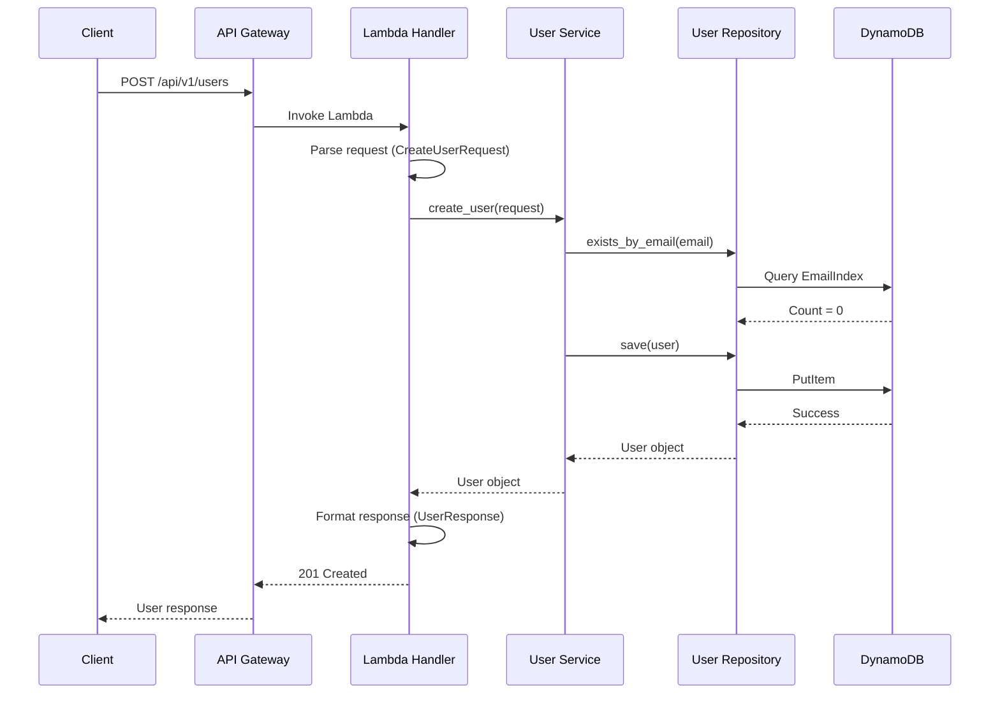
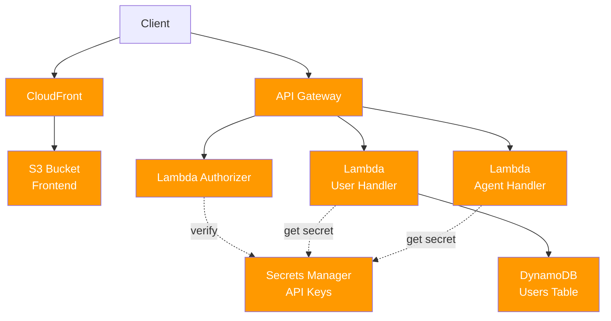
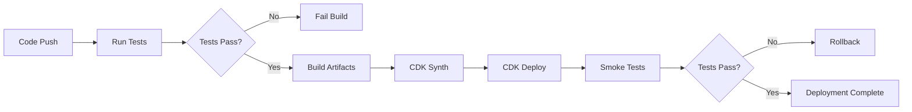

# Documentation Generation Skill - Enterprise Specification

## Directive

This skill generates accurate, maintainable documentation that is **directly derived from the codebase**. Documentation MUST NOT include speculation, assumptions, or invented architecture.

**Primary Goal**: Produce clear, factual documentation that developers and operators can trust and maintain.

**Core Principle**: Document only what exists in the code, infrastructure definitions, and configuration. Never invent system components or architecture.

---

## 1. DOCUMENTATION PRINCIPLES (MANDATORY)

### 1.1 Source of Truth

Documentation MUST be generated ONLY from:
- ✅ Source code (handlers, services, repositories)
- ✅ Infrastructure definitions (CDK stacks)
- ✅ Configuration files (.env, config.py)
- ✅ Deployment scripts
- ✅ Test files
- ✅ Package dependencies (requirements.txt, package.json)

Documentation MUST NOT include:
- ❌ Speculative architecture
- ❌ Assumed system components not in code
- ❌ Future features or intentions
- ❌ Undocumented external systems
- ❌ Complex architecture diagrams not derivable from code

### 1.2 Accuracy Over Completeness

**Prefer**:
- ✅ Simple, accurate descriptions of what exists
- ✅ "Not currently implemented" over speculation
- ✅ Direct quotes from code/config
- ✅ Conservative scope

**Avoid**:
- ❌ Guessing about system behavior
- ❌ Describing features not in code
- ❌ Architectural assumptions
- ❌ Elaborate diagrams not backed by code

### 1.3 Maintainability

Documentation must:
- Remain synchronized with code changes
- Be simple to update when code changes
- Include references to source files
- Be factual and verifiable

---

## 2. MANDATORY DOCUMENTATION STRUCTURE

ALL projects MUST follow this structure:

```
project-root/
  README.md              # Project overview
  docs/
    api.md               # API reference
    setup.md             # Local development setup
    deployment.md        # Deployment guide
    infrastructure.md    # Cloud resources
    operations.md        # Monitoring and maintenance
    runbooks/            # Troubleshooting guides
      high-error-rate.md
      performance-degradation.md
```

---

## 3. API DOCUMENTATION

### 3.1 Source

Generate API documentation by analyzing:
- Lambda handler functions (`src/handlers/*.py`)
- API Gateway route definitions (CDK stacks)
- DTO/schema definitions (`src/dto/*.py`)
- Middleware decorators

### 3.2 Required Information

For EACH endpoint, document:
- Endpoint path
- HTTP method
- Request schema (derived from Pydantic models)
- Response schema (derived from response DTOs)
- Authentication requirements (from decorators)
- Error responses (from error handling code)

### 3.3 Template

**File**: `docs/api.md`

```markdown
# API Reference

Base URL: `https://api.example.com`

## Authentication

All endpoints require Bearer token authentication unless marked as public.

```http
Authorization: Bearer {token}
```

---

## Endpoints

### POST /api/v1/users

Create a new user account.

**Authentication**: Required

**Request Body**:
```json
{
  "email": "string (required, format: email)",
  "name": "string (required, min: 1, max: 100)",
  "role": "string (optional, enum: [admin, user, guest])"
}
```

**Response (201 Created)**:
```json
{
  "id": "string (uuid)",
  "email": "string",
  "name": "string",
  "role": "string",
  "is_active": "boolean"
}
```

**Error Responses**:

**400 Bad Request** - Validation error
```json
{
  "errorCode": "VALIDATION_ERROR",
  "message": "Invalid email format",
  "correlationId": "uuid"
}
```

**409 Conflict** - User already exists
```json
{
  "errorCode": "CONFLICT",
  "message": "User with email already exists",
  "correlationId": "uuid"
}
```

**500 Internal Server Error** - Server error
```json
{
  "errorCode": "INTERNAL_ERROR",
  "message": "Internal server error",
  "correlationId": "uuid"
}
```

**Example Request**:
```bash
curl -X POST https://api.example.com/api/v1/users \
  -H "Content-Type: application/json" \
  -H "Authorization: Bearer {token}" \
  -d '{
    "email": "user@example.com",
    "name": "John Doe",
    "role": "user"
  }'
```

**Implementation**: `backend/lambdas/user/src/handlers/user_handler.py:create_user()`

---

### GET /api/v1/users/{user_id}

Retrieve user by ID.

**Authentication**: Required

**Path Parameters**:
- `user_id` (string, uuid): User identifier

**Response (200 OK)**:
```json
{
  "id": "string",
  "email": "string",
  "name": "string",
  "role": "string",
  "is_active": "boolean"
}
```

**Error Responses**:

**404 Not Found** - User not found
```json
{
  "errorCode": "NOT_FOUND",
  "message": "User not found",
  "correlationId": "uuid"
}
```

**Implementation**: `backend/lambdas/user/src/handlers/user_handler.py:get_user()`
```

### 3.4 API Documentation Rules

**MUST**:
- List all endpoints found in handler code
- Document request/response schemas from DTO classes
- Include authentication requirements from decorators
- List error responses from error handling code
- Reference implementation file and function
- Use actual enum values from code
- Include field validation rules from Pydantic models

**MUST NOT**:
- Document endpoints that don't exist
- Guess at request/response formats
- Invent authentication schemes not in code
- Add examples that contradict actual schemas

### 3.5 Deriving API Documentation

**From Handler Code**:
```python
# File: src/handlers/user_handler.py
@app.post("/api/v1/users")
@require_auth  # ← Authentication required
@tracer.capture_method
def create_user():
    """Create new user."""  # ← Endpoint description
    request_data = CreateUserRequest(**app.current_event.json_body)
    # ↑ Request schema from CreateUserRequest

    service = UserService()
    user = service.create_user(request_data)

    return UserResponse.from_domain(user).dict(), 201
    # ↑ Response schema from UserResponse, status code 201
```

**From DTO Definitions**:
```python
# File: src/dto/request.py
class CreateUserRequest(BaseModel):
    """Request schema for user creation."""

    email: EmailStr = Field(..., description="User email address")
    name: str = Field(..., min_length=1, max_length=100)
    role: Optional[str] = Field(None, pattern="^(admin|user|guest)$")
    # ↑ Extract field types, constraints, descriptions
```

**From Error Handling**:
```python
# File: src/handlers/user_handler.py
except ValueError as e:
    return ErrorResponse(
        errorCode="VALIDATION_ERROR",  # ← Error code
        message=str(e),
        correlationId=logger.get_correlation_id()
    ).dict(), 400  # ← Status code
```

---

## 4. CODE DOCUMENTATION (DOCSTRINGS)

### 4.1 Required Docstrings

ALL of the following MUST have docstrings:
- Public functions
- Public methods
- Classes
- Modules

### 4.2 Docstring Format (Python - Google Style)

```python
def create_user(self, request: CreateUserRequest) -> User:
    """
    Create a new user with business rules applied.

    Args:
        request: Validated user creation request containing email, name, and optional role

    Returns:
        Created user domain object with generated ID and timestamp

    Raises:
        ValueError: If user with email already exists
        ValidationError: If request data is invalid
    """
    # Implementation...
```

### 4.3 Docstring Requirements

**MUST include**:
- One-line summary (first line)
- Description of what the function does
- Args section with parameter descriptions
- Returns section with return value description
- Raises section listing exceptions

**MUST NOT include**:
- Implementation details that change frequently
- Redundant information (e.g., "Returns user" when return type is `User`)
- TODO comments or future plans

### 4.4 Class Docstrings

```python
class UserService:
    """
    User business logic service.

    Handles user creation, updates, and retrieval with business rule enforcement.
    Coordinates between repositories and applies domain logic.
    """

    def __init__(self, repository: Optional[UserRepository] = None):
        """
        Initialize service with repository dependency.

        Args:
            repository: User data repository (defaults to UserRepository instance)
        """
        self.repository = repository or UserRepository()
```

### 4.5 Module Docstrings

```python
"""
User handler module.

Defines Lambda handler functions for user management API endpoints.
Handles request parsing, service orchestration, and response formatting.
"""

from opentelemetry import trace
import logging
# ... rest of module
```

### 4.6 TypeScript Docstrings (TSDoc)

```typescript
/**
 * User service for managing user data.
 *
 * Handles API communication for user operations including
 * creation, retrieval, and updates.
 */
@Injectable({ providedIn: 'root' })
export class UserService {

  /**
   * Creates a new user account.
   *
   * @param request - User creation request data
   * @returns Observable of created user
   * @throws Error if user already exists or validation fails
   */
  createUser(request: CreateUserRequest): Observable<User> {
    return this.http.post<User>(this.apiUrl, request).pipe(
      retry(1),
      catchError(this.handleError)
    );
  }
}
```

---

## 5. SETUP DOCUMENTATION

### 5.1 Source

Derive setup documentation from:
- Project dependencies (requirements.txt, package.json)
- Environment configuration (.env.example)
- README sections
- Build scripts
- Test commands

### 5.2 Template

**File**: `docs/setup.md`

```markdown
# Development Setup Guide

## Prerequisites

- Python 3.12+
- Node.js 18+
- AWS CLI configured with credentials
- AWS CDK CLI: `npm install -g aws-cdk`
- Angular CLI: `npm install -g @angular/cli`

## Backend Setup

### 1. Install Dependencies

```bash
cd backend/lambdas/user
python -m venv venv
source venv/bin/activate  # Windows: venv\Scripts\activate
pip install -r requirements.txt
```

### 2. Configure Environment

```bash
cp .env.example .env
```

Edit `.env` and set:
```
AWS_REGION=us-east-1
AWS_ACCOUNT_ID=your-account-id
ANTHROPIC_API_KEY=your-api-key
```

### 3. Run Tests

```bash
pytest tests/
```

## Frontend Setup

### 1. Install Dependencies

```bash
cd frontend
npm install
```

### 2. Run Development Server

```bash
ng serve
```

Application available at: http://localhost:4200

### 3. Run Tests

```bash
ng test
```

## Infrastructure Setup

### 1. Install CDK Dependencies

```bash
cd infra
pip install -r requirements.txt
```

### 2. Bootstrap CDK (First Time Only)

```bash
cdk bootstrap aws://{account-id}/{region}
```

### 3. Synthesize CloudFormation

```bash
cdk synth
```

## Common Issues

### Issue: Python version mismatch
**Solution**: Ensure Python 3.12+ is installed. Check with `python --version`

### Issue: AWS credentials not configured
**Solution**: Run `aws configure` and enter access key, secret key, and region

## Next Steps

- Review [API documentation](api.md)
- Review [deployment guide](deployment.md)
```

### 5.3 Setup Documentation Rules

**MUST**:
- List actual prerequisites from project dependencies
- Include commands that actually work
- Reference actual configuration files (.env.example)
- Document test commands found in code/scripts
- Include common errors encountered during setup

**MUST NOT**:
- Assume tools not listed in dependencies
- Document optional features not in code
- Include outdated or incorrect commands

---

## 6. DEPLOYMENT DOCUMENTATION

### 6.1 Source

Derive deployment documentation from:
- CDK stack definitions
- Deployment scripts
- CI/CD configuration files (.github/workflows, buildspec.yml)
- Environment configurations

### 6.2 Template

**File**: `docs/deployment.md`

```markdown
# Deployment Guide

## Overview

The system is deployed using AWS CDK. Deployment creates:
- Lambda functions for API handlers
- API Gateway REST API
- DynamoDB tables
- S3 buckets for frontend hosting
- CloudFront distribution

## Environments

- **dev**: Development environment (auto-deployed on merge to `develop`)
- **staging**: Pre-production environment (manual deployment)
- **prod**: Production environment (manual deployment with approval)

## Prerequisites

- AWS CLI configured with appropriate credentials
- AWS CDK CLI installed
- IAM permissions for CloudFormation, Lambda, API Gateway, DynamoDB, S3, CloudFront

## Deployment Steps

### 1. Build Backend

```bash
cd backend/lambdas/user
pip install -r requirements.txt -t package/
```

### 2. Build Frontend

```bash
cd frontend
ng build --configuration=production
```

### 3. Deploy Infrastructure

**Development**:
```bash
cd infra
export ENVIRONMENT=dev
cdk deploy --all --require-approval never
```

**Staging**:
```bash
cd infra
export ENVIRONMENT=staging
cdk deploy --all
```

**Production** (requires approval):
```bash
cd infra
export ENVIRONMENT=prod
cdk deploy --all
```

### 4. Verify Deployment

Check CloudFormation stacks:
```bash
aws cloudformation describe-stacks \
  --stack-name VirtualAssistConnectApi-${ENVIRONMENT}
```

Test API endpoint:
```bash
curl https://{api-url}/api/v1/health
```

## Rollback Procedure

### Lambda Rollback

Revert to previous version:
```bash
aws lambda update-alias \
  --function-name user-handler-${ENVIRONMENT} \
  --name live \
  --function-version {previous-version}
```

### Full Stack Rollback

```bash
cd infra
git checkout {previous-commit}
cdk deploy --all
```

## Post-Deployment

### Smoke Tests

Run automated smoke tests:
```bash
./scripts/smoke-test.sh ${API_URL}
```

### Monitoring

- CloudWatch Logs: `/aws/lambda/{function-name}`
- CloudWatch Metrics: `VirtualAssist` namespace
- X-Ray Traces: AWS X-Ray console

## Troubleshooting

### Deployment Failure

**Symptom**: CDK deploy fails with CloudFormation error

**Diagnosis**:
```bash
aws cloudformation describe-stack-events \
  --stack-name {stack-name}
```

**Resolution**: Review stack events for specific error. Common causes:
- IAM permission issues
- Resource limit exceeded
- Invalid configuration

### Lambda Cold Start Issues

**Symptom**: High latency on first request

**Resolution**: Configure provisioned concurrency in CDK:
```python
function.add_alias("live", provisioned_concurrent_executions=2)
```
```

### 6.3 Deployment Documentation Rules

**MUST**:
- Document actual deployment commands from scripts/CDK
- List environments defined in infrastructure code
- Include rollback procedures that actually work
- Reference actual stack names from CDK
- Document smoke tests if they exist in code

**MUST NOT**:
- Document deployment processes not implemented
- Assume CI/CD pipelines not in code
- Invent rollback procedures

---

## 7. INFRASTRUCTURE DOCUMENTATION

### 7.1 Source

Derive infrastructure documentation ONLY from:
- CDK stack definitions (infra/stacks/*.py)
- CloudFormation templates (if used)
- Terraform files (if used)

### 7.2 Template

**File**: `docs/infrastructure.md`

```markdown
# Infrastructure Overview

## AWS Resources

This system uses the following AWS resources, defined in CDK stacks.

### API Stack

**File**: `infra/stacks/api_stack.py`

**Resources**:

#### API Gateway
- **Type**: REST API
- **Name**: `virtualassist-connect-api-{environment}`
- **Purpose**: HTTP API for user operations
- **Features**: CORS enabled, CloudWatch logging, X-Ray tracing
- **Stage**: Environment-specific (dev, staging, prod)

#### Lambda Functions

**User Handler**
- **Runtime**: Python 3.12
- **Memory**: 512 MB
- **Timeout**: 30 seconds
- **Handler**: `src.handlers.user_handler.lambda_handler`
- **Environment Variables**:
  - `ENVIRONMENT`: Deployment environment
  - `OTEL_SERVICE_NAME`: user-api
  - `LOG_LEVEL`: INFO
- **IAM Permissions**: DynamoDB GetItem, PutItem, Query on users table
- **Tracing**: AWS X-Ray enabled
- **Logs**: CloudWatch log group with 7-day retention

**Agent Handler**
- **Runtime**: Python 3.12
- **Memory**: 1024 MB
- **Timeout**: 60 seconds
- **Handler**: `src.handlers.agent_handler.lambda_handler`
- **Purpose**: AI agent request processing

### Frontend Stack

**File**: `infra/stacks/frontend_stack.py`

**Resources**:

#### S3 Bucket
- **Purpose**: Frontend static file hosting
- **Encryption**: S3-managed (SSE-S3)
- **Public Access**: Blocked (accessed via CloudFront only)
- **Removal Policy**: Destroy (dev), Retain (prod)

#### CloudFront Distribution
- **Origin**: S3 bucket via Origin Access Identity
- **HTTPS**: Enforced (redirect HTTP to HTTPS)
- **Caching**: CloudFront caching optimized policy
- **Error Handling**: SPA routing (404 → /index.html)

### AI Stack

**File**: `infra/stacks/ai_stack.py`

**Resources**:

#### Secrets Manager
- **Secret Name**: `virtualassist-connect/anthropic-api-key-{environment}`
- **Purpose**: Secure storage for Anthropic API key

#### IAM Managed Policy
- **Name**: `virtualassist-connect-bedrock-{environment}`
- **Permissions**: Bedrock InvokeModel, InvokeModelWithResponseStream
- **Attached To**: Lambda execution roles

## Resource Tagging

All resources tagged with:
- `Environment`: dev | staging | prod
- `Service`: Service name (e.g., user-api)
- `ManagedBy`: CDK

## Cost Optimization

- Lambda: Right-sized memory (512 MB - 1024 MB)
- API Gateway: Standard REST API (not private)
- CloudWatch Logs: 7-day retention (dev), 30-day (prod)
- S3: Lifecycle policies for old versions

## Security

- All S3 buckets: Encryption enabled
- Lambda functions: X-Ray tracing enabled
- API Gateway: CORS configured for specific origins
- IAM: Least privilege policies
- Secrets: Stored in Secrets Manager, not in code
```

### 7.3 Infrastructure Documentation Rules

**MUST**:
- List ONLY resources defined in CDK/Terraform code
- Include actual configuration values from code
- Reference source file for each resource
- Document IAM permissions from code
- List environment variables from Lambda definitions

**MUST NOT**:
- Document infrastructure not in code
- Assume resources not explicitly created
- Invent architecture diagrams not derivable from code
- Guess at resource configurations

---

## 8. OPERATIONS DOCUMENTATION

### 8.1 Source

Derive operations documentation from:
- Logging configuration in code
- CloudWatch log groups in CDK
- Metrics definitions in code
- Alarm configurations in CDK
- Tracing configuration

### 8.2 Template

**File**: `docs/operations.md`

```markdown
# Operations Guide

## Monitoring

### Logs

**Location**: AWS CloudWatch Logs

**Log Groups**:
- `/aws/lambda/user-handler-{environment}` - User API logs
- `/aws/lambda/agent-handler-{environment}` - AI agent logs
- `/aws/apigateway/virtualassist-connect-api-{environment}` - API Gateway logs

**Log Format**: Structured JSON (via Lambda Powertools)

**Log Fields**:
- `timestamp`: ISO 8601 timestamp
- `level`: INFO | ERROR | WARNING
- `message`: Log message
- `correlation_id`: Request correlation ID
- `service`: Service name
- Custom fields from logger.info(..., extra={...})

**Query Examples**:

Find errors in last hour:
```
fields @timestamp, level, message, correlation_id
| filter level = "ERROR"
| sort @timestamp desc
| limit 100
```

Find slow requests (>2s):
```
fields @timestamp, message, duration
| filter message like /User created/
| filter duration > 2000
| sort duration desc
```

### Metrics

**Namespace**: `VirtualAssist`

**Available Metrics**:
- `UserCreated` (Count): Number of users created
- `ColdStart` (Count): Lambda cold starts
- Lambda standard metrics: Invocations, Errors, Duration, Throttles

**Viewing Metrics**:
```bash
aws cloudwatch get-metric-statistics \
  --namespace VirtualAssist \
  --metric-name UserCreated \
  --start-time 2024-01-01T00:00:00Z \
  --end-time 2024-01-02T00:00:00Z \
  --period 3600 \
  --statistics Sum
```

### Tracing

**Service**: AWS X-Ray

**Viewing Traces**:
1. Open AWS X-Ray console
2. Filter by service name: `user-api`
3. View service map and trace timeline

**Correlation**:
- Each request has correlation ID
- Correlation ID appears in logs and traces
- Use correlation ID to track request across services

### Alerts

**Current Alerts**:
- High error rate (>5% for 5 minutes)
- High latency (P95 >3 seconds for 10 minutes)
- Lambda throttles (>10 in 5 minutes)

**Alert Destination**: SNS topic `virtualassist-alerts-{environment}`

## Debugging

### Find Logs for Specific Request

1. Get correlation ID from error response or user report
2. Query CloudWatch Logs:
```
fields @timestamp, @message
| filter correlation_id = "{correlation-id}"
| sort @timestamp asc
```

### Investigate Lambda Errors

1. Check CloudWatch Logs for error messages
2. View X-Ray trace for failed request
3. Check Lambda metrics for throttles or timeouts
4. Review recent deployments for correlation

### Performance Investigation

1. Check CloudWatch metrics for latency spikes
2. View X-Ray service map for bottlenecks
3. Query logs for slow operations
4. Check DynamoDB throttling metrics

## Maintenance

### Log Retention

- **Development**: 7 days
- **Production**: 30 days

Configured in CDK: `log_retention=logs.RetentionDays.ONE_WEEK`

### Database Backups

- **DynamoDB**: Point-in-time recovery enabled (if configured in CDK)
- **Backup frequency**: Continuous
- **Retention**: 35 days

### Deployment History

View CloudFormation stack events:
```bash
aws cloudformation describe-stack-events \
  --stack-name VirtualAssistConnectApi-{environment}
```

View Lambda function versions:
```bash
aws lambda list-versions-by-function \
  --function-name user-handler-{environment}
```
```

### 8.3 Operations Documentation Rules

**MUST**:
- Document log groups defined in CDK
- List metrics actually collected in code
- Include query examples that work
- Reference tracing if enabled in code
- Document alerts if configured in CDK

**MUST NOT**:
- Document monitoring not implemented
- Assume alerts not in code
- Invent debugging procedures without basis

---

## 9. RUNBOOKS

### 9.1 Purpose

Runbooks provide step-by-step troubleshooting for common operational scenarios.

### 9.2 Template

**File**: `docs/runbooks/high-error-rate.md`

```markdown
# Runbook: High API Error Rate

## Symptoms

- CloudWatch alarm triggered: `HighErrorRate`
- Users reporting errors when using the application
- API returning 500 Internal Server Error responses

## Severity

**High** - Impacts user functionality

## Diagnosis

### 1. Check CloudWatch Metrics

```bash
aws cloudwatch get-metric-statistics \
  --namespace AWS/Lambda \
  --metric-name Errors \
  --dimensions Name=FunctionName,Value=user-handler-prod \
  --start-time $(date -u -d '1 hour ago' +%Y-%m-%dT%H:%M:%S) \
  --end-time $(date -u +%Y-%m-%dT%H:%M:%S) \
  --period 300 \
  --statistics Sum
```

### 2. Check Recent Logs

```bash
aws logs tail /aws/lambda/user-handler-prod --follow --filter-pattern "ERROR"
```

Look for:
- Exception messages
- Correlation IDs of failed requests
- Error patterns (same error repeated)

### 3. Check Recent Deployments

```bash
aws lambda list-versions-by-function \
  --function-name user-handler-prod \
  --max-items 5
```

Determine if error rate increased after recent deployment.

### 4. Check Downstream Services

- DynamoDB throttling metrics
- Bedrock/Anthropic API availability
- Secrets Manager access

## Common Causes

### Cause 1: Recent Deployment Introduced Bug

**Symptoms**:
- Error rate spiked immediately after deployment
- Specific error message in logs

**Resolution**:
1. Rollback to previous Lambda version (see [Deployment Guide](../deployment.md#rollback-procedure))
2. Investigate code changes in latest deployment
3. Fix bug and redeploy

### Cause 2: DynamoDB Throttling

**Symptoms**:
- Logs show `ProvisionedThroughputExceededException`
- DynamoDB throttle metrics elevated

**Resolution**:
1. Check DynamoDB table capacity
2. Temporarily increase provisioned capacity or enable auto-scaling
3. Investigate query patterns causing high throughput

### Cause 3: External Service Unavailable

**Symptoms**:
- Logs show timeout or connection errors to external service
- Errors only for requests requiring external service

**Resolution**:
1. Check external service status (Anthropic, AWS services)
2. Implement retry logic if not present
3. Consider circuit breaker pattern for external calls

### Cause 4: Lambda Timeout

**Symptoms**:
- Logs show "Task timed out after X seconds"
- Latency metrics show requests approaching timeout limit

**Resolution**:
1. Increase Lambda timeout in CDK configuration
2. Investigate slow operations in code
3. Optimize database queries or external calls

## Mitigation Actions

### Immediate (Stop the Bleeding)

1. **Rollback** if caused by recent deployment
2. **Increase capacity** if throttling issue
3. **Disable feature** if specific endpoint causing issues

### Short-term (Within Hours)

1. Monitor error rate for improvement
2. Analyze root cause from logs and metrics
3. Prepare fix if code issue identified

### Long-term (Within Days)

1. Deploy fix for root cause
2. Add monitoring/alerts to catch issue earlier
3. Update runbook with lessons learned

## Escalation

If unable to resolve within 1 hour:
- **Escalate to**: Engineering Lead
- **Contact**: Provide correlation IDs and error summary
- **Information needed**: Error rate graph, sample error logs, recent deployment info

## Post-Incident

- Document root cause
- Update monitoring/alerts
- Consider preventive measures (better testing, gradual rollout)
```

### 9.3 Additional Runbook Examples

**File**: `docs/runbooks/performance-degradation.md`

```markdown
# Runbook: Performance Degradation

## Symptoms

- Increased API latency
- Users reporting slow response times
- CloudWatch alarm: `HighLatency`

## Diagnosis

### 1. Check Latency Metrics

```bash
aws cloudwatch get-metric-statistics \
  --namespace AWS/Lambda \
  --metric-name Duration \
  --dimensions Name=FunctionName,Value=user-handler-prod \
  --start-time $(date -u -d '1 hour ago' +%Y-%m-%dT%H:%M:%S) \
  --end-time $(date -u +%Y-%m-%dT%H:%M:%S) \
  --period 300 \
  --statistics Average,Maximum
```

### 2. Check X-Ray Traces

1. Open AWS X-Ray console
2. View service map for bottlenecks
3. Examine slow traces
4. Identify slow subsegments (database, external calls)

### 3. Check for Cold Starts

Query logs:
```
fields @timestamp, @message
| filter @message like /REPORT/
| filter @message like /Init Duration/
| stats count() as cold_starts by bin(5m)
```

## Common Causes

### Cause 1: Database Query Performance

**Resolution**:
- Review query patterns in slow traces
- Check for missing indexes
- Consider caching for frequent queries

### Cause 2: External API Latency

**Resolution**:
- Check third-party service status
- Implement timeout limits
- Consider caching responses

### Cause 3: Lambda Cold Starts

**Resolution**:
- Configure provisioned concurrency
- Optimize Lambda package size
- Review initialization code

## Mitigation Actions

[Similar structure to high-error-rate runbook]
```

### 9.4 Runbook Rules

**MUST**:
- Provide specific, actionable diagnostic steps
- Include actual commands that work
- Reference log groups and metrics that exist
- Base common causes on observed issues (if available)
- Include escalation procedures

**MUST NOT**:
- Include speculative troubleshooting
- Assume monitoring not implemented
- Document resolution steps for non-existent features

---

## 10. DIAGRAMS

### 10.1 Allowed Diagrams

Generate diagrams ONLY when structure can be directly derived from code/infrastructure:

✅ **Allowed**:
- Request flow through Lambda handlers
- CDK stack resource relationships
- Deployment pipeline from CI/CD config
- Basic infrastructure topology from CDK

❌ **Forbidden**:
- Speculative system architecture
- Complex C4 diagrams not backed by code
- Assumed inter-service communication
- Future-state diagrams

### 10.2 Diagram Format

ALL diagrams MUST use Mermaid syntax.

### 10.3 Request Flow Diagram

**Derive from**: Handler code showing function calls



### 10.4 Infrastructure Diagram

**Derive from**: CDK stack definitions



### 10.5 Deployment Pipeline Diagram

**Derive from**: CI/CD configuration files



### 10.6 Diagram Rules

**MUST**:
- Derive from actual code/infrastructure
- Keep diagrams simple and factual
- Use Mermaid syntax
- Label components with actual resource names

**MUST NOT**:
- Create complex architecture diagrams without code basis
- Assume components not in infrastructure code
- Use external diagram tools requiring separate files
- Include speculative future architecture

---

## 11. ROOT README

### 11.1 Template

**File**: `README.md`

```markdown
# virtualassist-connect

AI-powered virtual assistant application.

## Technology Stack

- **Backend**: Python 3.12, AWS Lambda
- **Frontend**: Angular 17, TypeScript
- **Infrastructure**: AWS CDK (Python)
- **Cloud**: AWS (API Gateway, Lambda, DynamoDB, S3, CloudFront)

## Project Structure

```
├── backend/           # Python Lambda functions
├── frontend/          # Angular application
├── infra/             # AWS CDK infrastructure code
├── docs/              # Documentation
│   ├── api.md
│   ├── setup.md
│   ├── deployment.md
│   ├── infrastructure.md
│   └── operations.md
└── tests/             # Integration tests
```

## Quick Start

See [Setup Guide](docs/setup.md) for detailed instructions.

### Backend

```bash
cd backend/lambdas/user
python -m venv venv
source venv/bin/activate
pip install -r requirements.txt
pytest tests/
```

### Frontend

```bash
cd frontend
npm install
ng serve
```

### Infrastructure

```bash
cd infra
pip install -r requirements.txt
cdk deploy --all
```

## Documentation

- [API Reference](docs/api.md)
- [Setup Guide](docs/setup.md)
- [Deployment Guide](docs/deployment.md)
- [Infrastructure Overview](docs/infrastructure.md)
- [Operations Guide](docs/operations.md)

## License

MIT
```

### 11.2 README Rules

**MUST**:
- List actual technology stack from dependencies
- Show actual project structure
- Link to documentation that exists
- Include working quick start commands

**MUST NOT**:
- Describe features not implemented
- Link to documentation that doesn't exist
- Include badges for services not configured

---

## 12. DOCUMENTATION STYLE STANDARDS

### 12.1 Structure

- Use clear hierarchical headers (##, ###, ####)
- Include table of contents for documents >100 lines
- Use consistent formatting throughout
- Group related information together

### 12.2 Language

- Use present tense ("The function returns..." not "The function will return...")
- Be concise and direct
- Use active voice ("Deploy the stack" not "The stack should be deployed")
- Avoid jargon unless necessary

### 12.3 Code Examples

- Include working code examples
- Use syntax highlighting (```python, ```bash, ```typescript)
- Show actual commands that work
- Include expected output when helpful

### 12.4 Formatting

**Commands**:
```bash
command --flag value
```

**Configuration**:
```yaml
key: value
```

**Inline code**: `variable_name`, `function_name()`

**Emphasis**: **important** or *note*

### 12.5 Maintenance

- Include file references (e.g., "Defined in: `path/to/file.py`")
- Date-stamp documentation if time-sensitive
- Mark deprecated features clearly
- Remove outdated information

---

## 13. QUALITY EXPECTATIONS

### 13.1 Accuracy Checklist

- [ ] All information derivable from code/config/infrastructure
- [ ] No invented or speculative architecture
- [ ] Commands tested and working
- [ ] File references accurate
- [ ] Configuration values match code
- [ ] No assumptions about features not in code

### 13.2 Maintainability Checklist

- [ ] Documentation references source files
- [ ] Easy to update when code changes
- [ ] No redundant information across docs
- [ ] Clear ownership of each document
- [ ] Diagrams generated from code

### 13.3 Usability Checklist

- [ ] Clear navigation structure
- [ ] Consistent formatting
- [ ] Practical examples included
- [ ] Troubleshooting guidance provided
- [ ] Appropriate level of detail

---

## 14. DOCUMENTATION GENERATION PROCESS

### 14.1 Steps

1. **Analyze codebase**:
   - Read handler functions
   - Parse DTO/schema definitions
   - Review CDK stacks
   - Check configuration files

2. **Extract facts**:
   - List endpoints from handlers
   - Extract schemas from DTOs
   - List resources from CDK
   - Note dependencies from requirements files

3. **Generate documentation**:
   - Create API docs from handlers/DTOs
   - Create infrastructure docs from CDK
   - Create setup docs from dependencies
   - Create operations docs from logging/metrics config

4. **Verify accuracy**:
   - Cross-reference with code
   - Test commands
   - Validate file paths
   - Check for speculation

5. **Format consistently**:
   - Apply style standards
   - Use templates
   - Add code examples
   - Include diagrams (if derivable)

### 14.2 Validation

Before finalizing documentation:

- [ ] All facts verifiable in code
- [ ] All commands tested
- [ ] All file references valid
- [ ] No speculation or assumptions
- [ ] Follows templates and style guide
- [ ] Includes practical examples
- [ ] Easy to maintain

---

**END OF SPECIFICATION**

This skill generates accurate, code-derived documentation that developers and operators can trust. Documentation is maintainable, practical, and never speculative.
