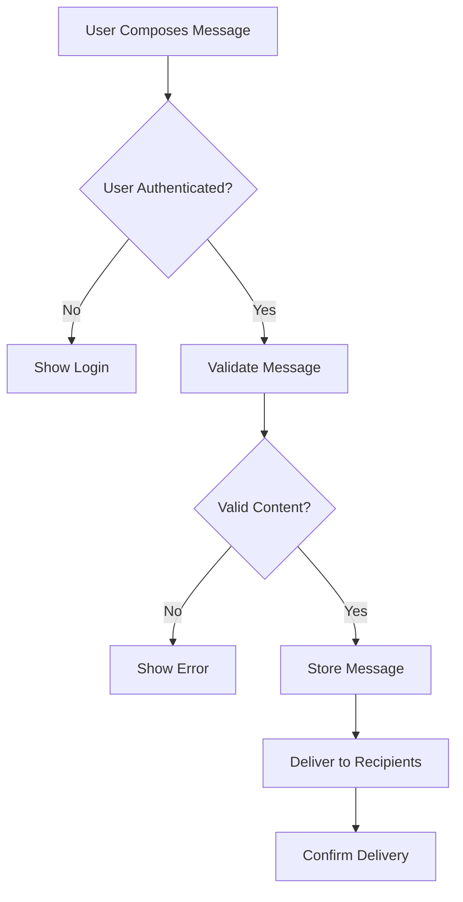
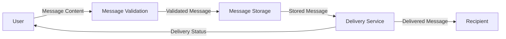

# Requirements Analysis Skill

## Purpose
Produce structured, design-ready requirement artifacts that clearly capture user needs, functional behavior, technical constraints, and traceability. Requirements must be clear, actionable, and suitable as inputs for system architecture and design.

## Requirements Principles

Requirements capture both business intent and technical expectations.

Analysis focuses on:
- Understanding user needs
- Defining functional capabilities
- Documenting technical requirements
- Capturing business rules
- Maintaining traceability across development stages

**Requirements must avoid implementation-level architecture assumptions.**

---

## Analysis Process

### 1. Scope Definition

Define the system boundary — what is in-scope and out-of-scope.

**Document:**
- **System Name**: Name of the system or service being specified
- **Purpose**: Brief statement of what the system does and why it exists
- **In-Scope**: Capabilities and behaviors the system will provide
- **Out-of-Scope**: Explicitly excluded capabilities, deferred features, or adjacent systems
- **Stakeholders**: Who requested or benefits from this system

**Example:**
```
System Name: VirtualAssist Chat Service
Purpose: Provide real-time messaging between authenticated users with AI-assisted responses.

In-Scope:
- User-to-user text messaging
- AI-generated response suggestions
- Message history and search

Out-of-Scope:
- Voice/video calling
- File sharing (deferred to Phase 2)
- Third-party chat platform integrations

Stakeholders: Product team, End Users, Customer Support
```

### 2. Glossary

Define domain-specific terms, acronyms, and abbreviations used throughout the requirements.

**Format:**
```
Term: [Term]
Definition: [Clear, unambiguous definition]
```

**Example:**
```
Term: Session
Definition: A conversation context between two or more participants, containing an ordered sequence of messages.

Term: PII
Definition: Personally Identifiable Information — any data that can identify a specific individual (e.g., email, name, phone number).

Term: AC
Definition: Acceptance Criteria — conditions that define when a requirement is satisfied.
```

**Include all terms that could be interpreted differently by different stakeholders.**

### 3. Persona Identification

Identify personas interacting with the system.

For each persona document:
- **Role**: What role they play
- **Goals**: What they want to achieve
- **Key Needs**: What problems they need solved

**Examples:**
- End User
- Administrator
- System Operator
- External System

### 4. Actor Identification

Identify all actors interacting with the system, including:
- Human users (different roles)
- External systems
- Third-party services
- Monitoring systems

**Actors must be identified before defining functional requirements**, as they are inputs to requirement definition.

**Format:**
```
Actor: [Name]
Type: [Human / External System / Service]
Interaction: [Brief description of how they interact]
```

**Example:**
```
Actor: End User
Type: Human
Interaction: Sends and receives messages via web/mobile client

Actor: Authentication Service
Type: External System
Interaction: Validates user identity and issues JWT tokens

Actor: AI Engine
Type: Service
Interaction: Receives message context, returns suggested responses
```

### 5. User Needs

For each persona, identify the key problems or needs the system must address.

**Format:**
```
Persona: [Persona Name]
Need: [Clear statement of need]
```

**Example:**
```
Persona: End User
Need: Send and receive chat messages in real time.
```

### 6. Functional Requirements

Define the functional capabilities the system must provide.

Each requirement must include:

- **Requirement ID**: Unique identifier (e.g., FR-001)
- **Description**: Clear statement of what the system must do
- **Persona Supported**: Which persona(s) this serves
- **Priority**: Must / Should / Could / Won't (MoSCoW)
- **Acceptance Criteria**: Conditions that define when the requirement is satisfied

**Functional requirements describe what the system must do.**

**Example:**
```
FR-001
Description: System must allow authenticated users to send text messages.
Persona: End User
Priority: Must
Acceptance Criteria:
- User can compose message up to 5000 characters
- Message is delivered within 3 seconds
- User receives confirmation of delivery
```

### 7. External Interface Requirements

Define how the system interfaces with users, hardware, other software systems, and communication protocols.

**Categories:**

**User Interfaces**
- Client platforms (web, mobile, desktop)
- Accessibility requirements (WCAG level)
- Responsive design constraints

**Software Interfaces**
- External APIs the system consumes or exposes
- Data formats exchanged (JSON, XML, etc.)
- Protocol requirements (REST, WebSocket, gRPC)

**Hardware Interfaces**
- Device constraints (if applicable)

**Communication Interfaces**
- Network protocols
- Encryption requirements for data in transit

**Format:**
```
Interface ID: IF-001
Type: [User / Software / Hardware / Communication]
Description: [What the interface does]
Source/Target: [External system or actor]
Data: [What data is exchanged]
Protocol: [How communication occurs]
```

**Example:**
```
IF-001
Type: Software
Description: System authenticates users via external identity provider.
Source/Target: AWS Cognito
Data: JWT tokens, user profile attributes
Protocol: HTTPS REST API (OAuth 2.0 / OIDC)

IF-002
Type: User
Description: End users interact via web browser.
Source/Target: End User
Data: Messages, session state, notifications
Protocol: HTTPS, WebSocket (if real-time)
```

### 8. Technical Requirements

Identify technical expectations and constraints necessary to support functionality.

Categories include:
- Performance expectations
- Scalability requirements
- Security requirements
- Availability expectations
- Deployment constraints
- Technology stack constraints

**Technical requirements must be measurable where possible.**

**Examples:**
```
TR-001: API latency < 200 ms at p95
TR-002: System availability 99.9%
TR-003: Support 10,000 concurrent users
TR-004: Data encrypted at rest and in transit
```

### 9. Business Rules

Extract explicit business rules that govern system behavior.

Each rule must include:
- **Rule ID**: Unique identifier (e.g., BR-001)
- **Description**: Clear statement of the rule
- **Conditions**: When the rule applies
- **Expected Outcome**: What should happen

**Examples:**
```
BR-001
Description: Users must be authenticated before sending messages.
Conditions: User attempts to send message
Expected Outcome: System validates authentication token; rejects if invalid

BR-002
Description: Only administrators can delete chat sessions.
Conditions: User attempts to delete chat session
Expected Outcome: System checks role; allows if admin, denies otherwise
```

### 10. Assumptions and Dependencies

Document assumptions made during requirements analysis and external dependencies the system relies on.

**Assumptions** are conditions believed to be true but not yet verified. If an assumption proves false, affected requirements must be revisited.

**Dependencies** are external systems, services, or conditions the system requires to function.

**Format:**
```
Assumption/Dependency ID: A-001 / D-001
Type: [Assumption / Dependency]
Description: [Clear statement]
Impact if Invalid: [What requirements are affected]
```

**Examples:**
```
A-001
Type: Assumption
Description: Users will have stable internet connections with latency < 500ms.
Impact if Invalid: Real-time messaging requirements (FR-001) may need offline queue support.

A-002
Type: Assumption
Description: Peak concurrent users will not exceed 10,000 in the first 12 months.
Impact if Invalid: Scalability requirements (TR-003) and cost estimates need revision.

D-001
Type: Dependency
Description: AWS Cognito is available in the target deployment region.
Impact if Invalid: Authentication requirements (FR-001, BR-001) need alternative identity provider.

D-002
Type: Dependency
Description: Amazon Bedrock Claude models are available for AI features.
Impact if Invalid: AI-assisted response features (FR-010) would be deferred.
```

### 11. Domain Model Extraction

Identify key domain entities implied by the requirements.

For each entity provide:
- **Entity Name**
- **Description**: Brief explanation of what it represents
- **Key Attributes**: Main properties (conceptual, not database schema)

**Examples:**
```
User
Description: Person who uses the system to send and receive messages
Key Attributes: identity, authentication status, role

ChatSession
Description: Conversation context containing messages between users
Key Attributes: participants, creation time, status

Message
Description: Text communication sent by a user
Key Attributes: content, sender, timestamp, delivery status
```

### 12. Workflow Identification

Extract major workflows from the requirements.

**Format:**
```
Workflow: [Name]
Steps:
1. [Action]
2. [Action]
3. [Action]
```

**Example:**
```
Workflow: User Sends Message
Steps:
1. User composes message
2. User submits message
3. System validates user authentication
4. System validates message content
5. System stores message
6. System delivers message to recipients
7. System confirms delivery to sender
```

### 13. Process Flow Diagrams

Generate process flow diagrams representing business workflows.

**Requirements:**
- Use Mermaid syntax
- Represent business process flow, not system architecture
- Show decision points and alternative paths
- Keep at business logic level

**Example:**


### 14. Data Flow Diagrams

Generate logical data flow diagrams showing movement of data between actors and system components.

**Requirements:**
- Remain conceptual and derived only from requirements
- Do not infer infrastructure components or microservices
- Show data inputs, transformations, and outputs
- Use Mermaid syntax

**Example:**


### 15. Acceptance Criteria

Each functional requirement must include acceptance criteria defining when the requirement is satisfied.

Acceptance criteria must be:
- Clear
- Testable
- Written from a user perspective

**Format:**
```
Given [context]
When [action]
Then [expected outcome]
```

**Example:**
```
FR-001 Acceptance Criteria:

AC-001:
Given user is authenticated
When user submits message with valid content
Then message is stored and delivered within 3 seconds

AC-002:
Given user is not authenticated
When user attempts to send message
Then system rejects request with 401 status
```

**Do not generate detailed test cases at the requirements stage.**

### 16. Traceability

Maintain traceability using the structure:

```
Persona → User Need → Requirement → User Story → Acceptance Criteria
```

**Traceability ensures every requirement maps back to a user need.**

**Example:**
```
Persona: End User
  ↓
User Need: Send messages in real time
  ↓
FR-001: System must allow authenticated users to send text messages
  ↓
User Story: As an end user, I want to send messages so I can communicate
  ↓
AC-001: Message delivered within 3 seconds
```

### 17. Ambiguity Detection

Identify unclear or ambiguous requirements and flag them for clarification.

**Examples of ambiguity:**
- Vague performance expectations ("should be fast")
- Missing acceptance criteria
- Undefined system behaviors ("handle errors appropriately")
- Unclear quantifications ("many users", "large files")
- Missing edge cases

**Flag with:**
```
AMBIGUITY DETECTED
Requirement: [ID or description]
Issue: [What is unclear]
Suggested Clarification: [What needs to be specified]
```

---

## Output Artifacts

Requirements analysis must generate the following artifacts. ALL artifacts MUST be output to the service domain's documentation folder: `docs/specs/lambdas/{name}/`.

**Version control**: All artifacts must be committed to the repository. Changes to requirements after initial approval must be tracked via new commits with clear descriptions of what changed and why.

### 1. scope.md
- System name, purpose, and stakeholders
- In-scope and out-of-scope boundaries

### 2. glossary.md
- Domain terms, acronyms, and abbreviations
- Clear, unambiguous definitions

### 3. {name}-personas.md
- Complete persona definitions
- Roles, goals, and key needs for each persona

### 4. actors.md
- All actors interacting with the system
- Actor types and interaction descriptions

### 5. user-needs.md
- User needs organized by persona
- Clear problem statements

### 6. requirements.md
- All functional requirements
- Structured with ID, description, persona, priority, acceptance criteria

### 7. external-interfaces.md
- User, software, hardware, and communication interfaces
- Protocols, data formats, and external system dependencies

### 8. technical-requirements.md
- All technical requirements and constraints
- Performance, scalability, security, availability expectations
- Measurable specifications

### 9. business-rules.md
- All business rules
- Structured with ID, description, conditions, expected outcome

### 10. assumptions-and-dependencies.md
- All assumptions with impact-if-invalid assessment
- All external dependencies with fallback impact

### 11. domain-model.md
- Key domain entities
- Entity descriptions and key attributes
- Entity relationships (conceptual)

### 12. workflows.md
- Major workflows extracted from requirements
- Step-by-step workflow descriptions

### 13. process-flows.md
- Process flow diagrams in Mermaid syntax
- Business process representations

### 14. data-flows.md
- Data flow diagrams in Mermaid syntax
- Logical data movement between actors and components

### 15. traceability.md
- Traceability matrix
- Persona → Need → Requirement → Story → Acceptance Criteria mappings

### 16. ambiguities.md
- Flagged ambiguities and unclear requirements
- Suggested clarifications

---

## Quality Expectations

Generated requirements must be:

- **Clear and unambiguous**: No vague language or undefined terms
- **Aligned with user needs**: Every requirement traces back to a user need
- **Traceable**: Maintain traceability across development stages
- **Suitable as design inputs**: Ready for architecture and system design
- **Testable**: Include clear acceptance criteria
- **Prioritized**: Must / Should / Could / Won't (MoSCoW) classification
- **Complete**: Cover all identified user needs and personas
- **Consistent**: No conflicting requirements

---

## Integration with Development Workflow

Requirements analysis output feeds into:

1. **System Architecture**: Technical requirements and domain model inform architecture decisions
2. **System Design**: Functional requirements and workflows guide design
3. **User Story Creation**: Requirements become detailed user stories
4. **Test Planning**: Acceptance criteria inform test case development
5. **Implementation**: Clear requirements enable accurate development

---

## Usage Guidelines

When performing requirements analysis:

1. **Define scope first**: Establish system boundaries before diving into details
2. **Build a glossary early**: Define terms as they emerge to prevent ambiguity
3. **Start with understanding**: Focus on personas, actors, and user needs
4. **Extract, don't invent**: Derive requirements from provided context
5. **Avoid architecture assumptions**: Stay at requirements level
6. **Flag gaps**: Identify missing information rather than making assumptions
7. **Document assumptions**: Record what you assumed and the impact if wrong
8. **Maintain traceability**: Ensure every requirement links to a user need
9. **Be specific**: Use measurable criteria where possible
10. **Generate all artifacts**: Produce complete set of output documents
11. **Validate quality**: Ensure requirements meet quality expectations

---

## Example Invocation

```
User: Analyze requirements for a real-time chat application
```

Expected output:
- Complete set of 16 artifacts
- Scope definition with in/out boundaries
- Glossary of domain terms
- Personas (End User, Administrator)
- Actors (End User, Admin, Auth Service, AI Engine)
- User needs (real-time communication, message management)
- Functional requirements (send message, receive message, etc.)
- External interfaces (Cognito, Bedrock, Angular 17+ web client)
- Technical requirements (latency < 200ms, 99.9% availability)
- Business rules (authentication required, admin privileges)
- Assumptions and dependencies
- Domain model (User, Message, ChatSession)
- Workflows and diagrams
- Traceability matrix
- Flagged ambiguities

---

## Anti-Patterns to Avoid

❌ **Don't** specify implementation details (e.g., "use Redis for caching")
✅ **Do** specify requirements (e.g., "message retrieval latency < 100ms")

❌ **Don't** design the architecture in requirements
✅ **Do** document constraints that will inform architecture

❌ **Don't** create requirements without user needs
✅ **Do** trace every requirement to a persona and need

❌ **Don't** use vague language ("fast", "scalable", "user-friendly")
✅ **Do** use measurable criteria ("< 200ms", "10,000 concurrent users")

❌ **Don't** skip ambiguity detection
✅ **Do** flag unclear requirements for clarification

❌ **Don't** leave assumptions undocumented
✅ **Do** explicitly record assumptions and assess their impact if wrong

❌ **Don't** define functional requirements before identifying actors
✅ **Do** identify who interacts with the system before defining what it does

---

## Success Criteria

Requirements analysis is successful when:

1. System scope is clearly defined with in/out boundaries
2. All domain terms are defined in the glossary
3. All personas, actors, and user needs are identified
4. All functional requirements have clear acceptance criteria
5. All external interfaces are documented
6. All technical requirements are measurable
7. All assumptions and dependencies are recorded with impact assessments
8. Complete traceability exists from personas to acceptance criteria
9. All 16 artifacts are generated
10. Requirements are suitable inputs for architecture and design
11. No ambiguities remain undetected
12. Requirements align with quality expectations
