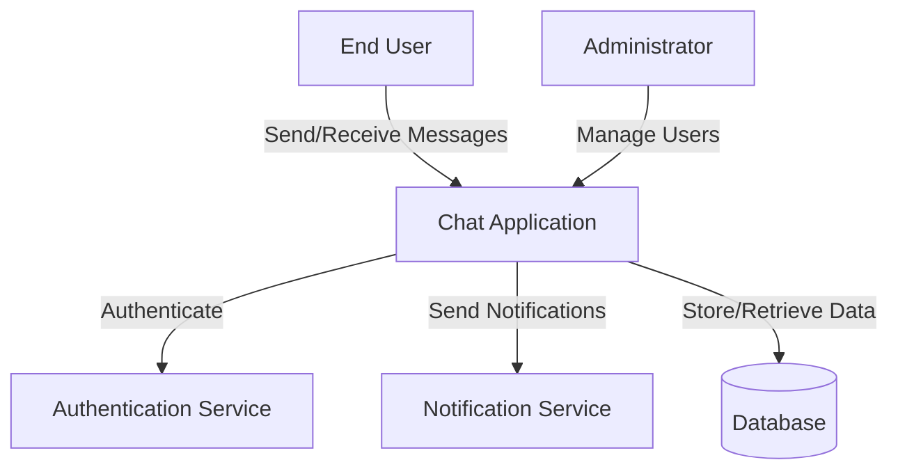
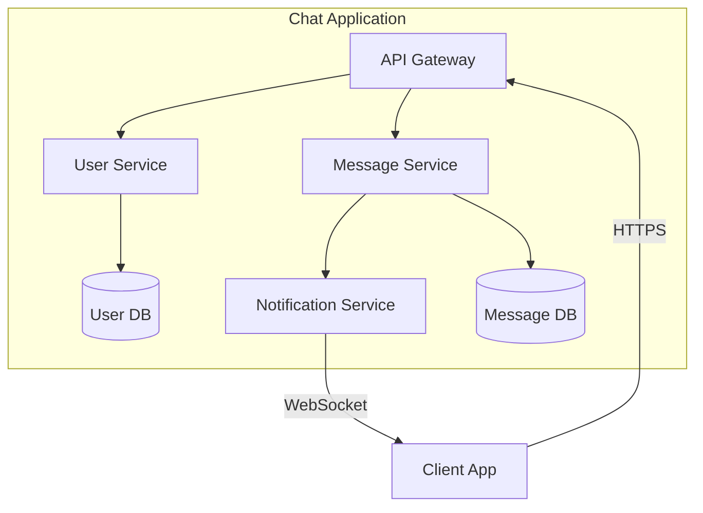
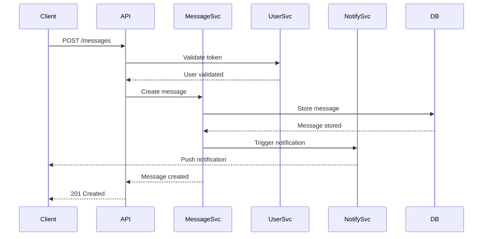

# System Design Skill

## Purpose
Transform structured requirements into clear and pragmatic system design. The design must define system architecture, services, APIs, data models, and integrations while maintaining simplicity and alignment with technical requirements.

## Design Principles

System design bridges requirements and implementation.

Design focuses on:
- Defining system architecture and patterns
- Decomposing functionality into services/components
- Designing APIs and interfaces
- Modeling data structures and relationships
- Planning integrations with external systems
- Ensuring technical requirements are met

**Design must remain pragmatic, avoiding over-engineering while meeting all requirements.**

---

## Design Process

### 1. Requirements Review

Review and validate inputs from requirements analysis:

- **Functional Requirements**: What the system must do
- **Technical Requirements**: Performance, scalability, security constraints
- **Business Rules**: Constraints governing system behavior
- **Domain Model**: Key entities and relationships
- **Workflows**: Business processes to support
- **Actors**: Users and systems interacting with the system

**Ensure all requirements are clear before proceeding with design.**

### 2. Architecture Pattern Selection

Select appropriate architecture pattern based on requirements.

**Common Patterns:**

**Monolithic Architecture**
- Single deployable unit
- Suitable for: Small to medium applications, simple domains, single team
- Pros: Simple deployment, easy debugging, lower operational overhead
- Cons: Scaling limitations, tight coupling

**Microservices Architecture**
- Multiple independent services
- Suitable for: Large applications, complex domains, multiple teams
- Pros: Independent scaling, technology diversity, fault isolation
- Cons: Distributed system complexity, operational overhead

**Layered Architecture**
- Organized in horizontal layers (presentation, business, data)
- Suitable for: Traditional enterprise applications
- Pros: Clear separation of concerns, well-understood pattern
- Cons: Can lead to tight coupling between layers

**Event-Driven Architecture**
- Components communicate via events
- Suitable for: Real-time systems, asynchronous workflows
- Pros: Loose coupling, scalability, real-time processing
- Cons: Eventual consistency, debugging complexity

**Serverless Architecture**
- Functions as a service (FaaS)
- Suitable for: Variable workloads, event-driven tasks
- Pros: Auto-scaling, pay-per-use, low operational overhead
- Cons: Cold start latency, vendor lock-in

**Selection Criteria:**
- Align with technical requirements (scalability, availability)
- Match team capabilities and organizational structure
- Consider operational complexity and cost
- Support identified workflows and integrations

**Document rationale for architecture pattern selection.**

### 3. System Context Diagram

Create a system context diagram showing the system and its interactions with external actors and systems.

**Requirements:**
- Use Mermaid C4 context diagram or simple graph
- Show the system as a single box
- Show all external actors (users, systems, services)
- Show key interactions and data flows

**Example:**


### 4. Service/Component Decomposition

Decompose the system into services or components based on:
- Domain boundaries (aligned with domain model)
- Functional requirements grouping
- Business capabilities
- Data ownership
- Team structure

**For each service/component define:**

**Service ID**: Unique identifier (e.g., SVC-001)
**Service Name**: Clear, descriptive name
**Responsibility**: What this service does
**Domain Entities**: Which domain entities it manages
**Dependencies**: Other services it depends on
**Technical Requirements**: Specific requirements it must meet

**Example:**
```
SVC-001: Message Service
Responsibility: Handle message creation, storage, and retrieval
Domain Entities: Message
Dependencies: User Service (for authentication), Notification Service
Technical Requirements:
- Message delivery < 3 seconds (TR-001)
- Support 10,000 concurrent connections (TR-003)
```

**Keep services cohesive and loosely coupled.**

### 5. Service Architecture Diagram

Create architecture diagram showing services and their interactions.

**Requirements:**
- Use Mermaid C4 container diagram or component diagram
- Show all services/components
- Show communication patterns (synchronous/asynchronous)
- Show data stores
- Indicate protocols (HTTP, gRPC, message queue)

**Example:**


### 6. API Design

Design APIs for each service exposed to clients or other services.

**For each API endpoint define:**

**Endpoint**: HTTP method and path
**Purpose**: What this endpoint does
**Authentication**: Required authentication/authorization
**Request**: Request body schema
**Response**: Response body schema
**Status Codes**: HTTP status codes and meanings
**Performance**: Expected latency
**Error Handling**: Error response format

**Example:**
```
POST /api/v1/messages
Purpose: Create and send a new message
Authentication: Bearer token (authenticated user)

Request:
{
  "recipient_id": "string (uuid)",
  "content": "string (max 5000 chars)",
  "session_id": "string (uuid)"
}

Response: 201 Created
{
  "message_id": "string (uuid)",
  "timestamp": "string (ISO 8601)",
  "status": "delivered"
}

Status Codes:
- 201: Message created successfully
- 400: Invalid request (malformed body, content too long)
- 401: Unauthorized (invalid/missing token)
- 404: Recipient not found
- 429: Rate limit exceeded
- 500: Internal server error

Performance: p95 latency < 200ms
```

**API Design Principles:**
- RESTful where appropriate (resource-oriented)
- Use standard HTTP methods (GET, POST, PUT, DELETE)
- Version APIs (e.g., /api/v1/)
- Use consistent naming conventions
- Include proper error responses
- Design for idempotency where needed
- Consider pagination for list endpoints
- Use DTOs for external boundaries; Services must return domain objects internally
- Plan observability explicitly: define OpenTelemetry metrics for critical operations
- Specify modern language standards (e.g., avoid deprecated features like `datetime.utcnow()`)

### 7. Data Model Design

Design data models for each service based on domain entities.

**For each data model define:**

**Model Name**: Entity name (e.g., User, Message)
**Service Owner**: Which service owns this data
**Attributes**: Fields with types and constraints
**Relationships**: Relationships to other entities
**Indexes**: Required indexes for query performance
**Constraints**: Business rules enforced at data level

**Example:**
```
Model: Message
Service Owner: Message Service

Attributes:
- message_id: UUID, primary key
- sender_id: UUID, not null, foreign key to User
- recipient_id: UUID, not null, foreign key to User
- session_id: UUID, not null, foreign key to ChatSession
- content: TEXT, max 5000 chars, not null
- created_at: TIMESTAMP, not null
- delivered_at: TIMESTAMP, nullable
- status: ENUM(pending, delivered, failed), not null

Relationships:
- Belongs to User (sender)
- Belongs to User (recipient)
- Belongs to ChatSession

Indexes:
- Primary: message_id
- Index: (session_id, created_at) for session message retrieval
- Index: (recipient_id, delivered_at) for unread messages

Constraints:
- sender_id != recipient_id (users cannot message themselves)
- created_at < delivered_at when status = delivered
```

**Data Model Principles:**
- Normalize to 3NF unless denormalization needed for performance
- Design for query patterns identified in workflows
- Enforce business rules via constraints where possible
- Consider data lifecycle and retention policies
- Plan for data migration and versioning

### 8. Integration Design

Design integrations with external systems and third-party services.

**For each integration define:**

**Integration ID**: Unique identifier
**External System**: Name of external system
**Purpose**: Why integration is needed
**Protocol**: Communication protocol (REST, gRPC, message queue)
**Authentication**: How system authenticates
**Data Flow**: Direction of data flow (inbound/outbound/bidirectional)
**Failure Handling**: How failures are handled
**Rate Limits**: Any rate limiting considerations

**Example:**
```
INT-001: Authentication Service Integration
External System: OAuth2 Provider (Auth0)
Purpose: User authentication and authorization
Protocol: HTTPS REST API
Authentication: Client credentials
Data Flow: Bidirectional (validate tokens, retrieve user info)
Failure Handling:
- Cache tokens with TTL
- Fallback to read-only mode if auth service unavailable
- Retry with exponential backoff
Rate Limits: 100 requests/second
```

### 9. Data Flow Design

Design detailed data flows for critical workflows identified in requirements.

**For each critical workflow create:**

**Workflow Name**: Name from requirements
**Trigger**: What initiates the workflow
**Steps**: Detailed data flow steps with service interactions
**Data Transformations**: How data changes between steps
**Error Scenarios**: What can go wrong and how it's handled
**Performance**: Expected end-to-end latency

**Use sequence diagrams to visualize:**



### 10. Security Design

Design security controls to meet security requirements.

**Security Layers:**

**Authentication**
- How users/systems authenticate
- Token management (JWT, OAuth2)
- Session management

**Authorization**
- Role-based access control (RBAC)
- Attribute-based access control (ABAC)
- Permission model

**Data Protection**
- Encryption at rest
- Encryption in transit (TLS)
- Data masking/anonymization

**API Security**
- Rate limiting
- Input validation
- CORS policies
- API keys/tokens

**Network Security**
- Firewall rules
- VPC/network segmentation
- DDoS protection

**Audit & Monitoring**
- Audit logging
- Security event monitoring
- Intrusion detection

**Example:**
```
Authentication: OAuth2 + JWT
- Users authenticate via OAuth2 provider
- JWT tokens issued with 1-hour expiration
- Refresh tokens stored securely with 30-day expiration

Authorization: RBAC
Roles:
- User: Can send/receive messages, view own sessions
- Admin: Can view all sessions, delete messages, manage users

Data Protection:
- Database encrypted at rest (AES-256)
- All API traffic over TLS 1.3
- PII fields (email, phone) hashed in logs

API Security:
- Rate limit: 100 requests/minute per user
- Input validation: JSON schema validation on all endpoints
- CORS: Whitelist specific origins
```

### 11. Scalability Design

Design for scalability to meet performance and load requirements.

**Horizontal Scaling**
- Which services can scale horizontally
- Load balancing strategy
- Session management (stateless vs stateful)

**Vertical Scaling**
- Resource allocation per service
- When vertical scaling is appropriate

**Caching Strategy**
- What to cache (frequent reads, expensive queries)
- Cache invalidation strategy
- Cache technology (Redis, Memcached)

**Database Scaling**
- Read replicas for read-heavy workloads
- Sharding strategy for write-heavy workloads
- Connection pooling

**Asynchronous Processing**
- Background jobs and queues
- Event-driven processing
- Message broker (RabbitMQ, Kafka)

**Example:**
```
Horizontal Scaling:
- Message Service: Auto-scale 2-10 instances based on CPU
- Load balancer: Round-robin with health checks
- Stateless design: No session affinity required

Caching:
- User profiles: Redis cache, 5-minute TTL
- Recent messages: Redis cache, 1-minute TTL
- Cache invalidation: Write-through on updates

Database:
- Primary-replica setup (1 primary, 2 read replicas)
- Read traffic routed to replicas
- Connection pool: 20 connections per service instance

Async Processing:
- Notification delivery: RabbitMQ queue
- Analytics events: Kafka topic
- Worker processes consume from queues
```

### 12. Availability & Reliability Design

Design for high availability and reliability to meet SLA requirements.

**Redundancy**
- Service redundancy (multiple instances)
- Data redundancy (replication, backups)
- Geographic redundancy (multi-region)

**Failure Handling**
- Circuit breaker pattern for service calls
- Retry logic with exponential backoff
- Graceful degradation

**Health Monitoring**
- Health check endpoints
- Service discovery and health checks
- Automatic instance replacement

**Disaster Recovery**
- Backup strategy and frequency
- Recovery time objective (RTO)
- Recovery point objective (RPO)
- Failover procedures

**Example:**
```
Availability: 99.9% (43.2 minutes downtime/month)

Redundancy:
- Minimum 2 instances per service across 2 availability zones
- Database: Primary-replica with automatic failover
- Multi-region: Active-passive setup

Failure Handling:
- Circuit breaker: Open after 5 consecutive failures
- Retry: 3 attempts with exponential backoff (1s, 2s, 4s)
- Graceful degradation: Read-only mode if primary DB fails

Disaster Recovery:
- Automated daily backups retained for 30 days
- RTO: 4 hours
- RPO: 1 hour
- Automated failover to passive region
```

### 13. Technology Stack Selection

Select specific technologies for each layer of the system.

**Selection Criteria:**
- Meets technical requirements
- Team expertise and learning curve
- Community support and maturity
- Operational requirements
- Cost considerations
- Integration compatibility

**Document for each layer:**

**Programming Languages**
- Language choices per service
- Rationale for selection

**Frameworks**
- Web frameworks
- Testing frameworks
- Rationale

**Data Stores**
- Relational databases
- NoSQL databases
- Caching layer
- Message brokers
- Rationale

**Infrastructure**
- Cloud provider (AWS, GCP, Azure)
- Container orchestration (Kubernetes, ECS)
- CI/CD tools
- Monitoring and logging
- Rationale

**Example:**
```
Programming Languages:
- Backend Services: Go
  Rationale: High performance, excellent concurrency, team expertise
- Frontend: TypeScript/React
  Rationale: Type safety, strong ecosystem, team expertise

Frameworks:
- Backend: Gin (Go web framework)
- Testing: Go testing, Testify
- ORM: GORM

Data Stores:
- Primary Database: PostgreSQL 15
  Rationale: ACID compliance, JSON support, strong query optimizer
- Cache: Redis 7
  Rationale: High performance, pub/sub for real-time notifications
- Message Queue: RabbitMQ
  Rationale: Reliable message delivery, team expertise

Infrastructure:
- Cloud: AWS
- Container Orchestration: EKS (Kubernetes)
- CI/CD: GitHub Actions, ArgoCD
- Monitoring: Prometheus, Grafana
- Logging: ELK Stack (Elasticsearch, Logstash, Kibana)
- Tracing: Jaeger
```

### 14. Deployment Architecture

Design deployment topology and infrastructure.

**Deployment Model:**
- Containers (Docker)
- Orchestration (Kubernetes, ECS)
- Serverless functions

**Environment Strategy:**
- Development, staging, production
- Environment parity
- Configuration management

**Infrastructure as Code:**
- Terraform, CloudFormation, Pulumi, AWS CDK
- Version control for infrastructure
- **CDK Rule (MANDATORY)**: NEVER hardcode AWS Account, Region, or computational limits (memory/timeouts) inside Stacks.
- **CDK Rule (MANDATORY)**: ALWAYS extract parameters into a multi-environment dictionary map (e.g. `infra/config.json`) and inject it into the Stack runtime.
- **CDK Rule (MANDATORY)**: AWS Layer ARNs mapped across regions MUST dynamically read `Stack.of(self).region` to avoid cross-region authorization 403s.

**Deployment Pipeline:**
- Build process
- Test automation
- Deployment stages
- Rollback strategy

**Example:**
```
Deployment Model: Containerized microservices on Kubernetes

Environments:
- Development: Single cluster, minimal resources
- Staging: Production-like, 50% resources
- Production: Multi-AZ, full resources

Infrastructure as Code:
- Terraform for cloud resources
- Helm charts for Kubernetes deployments
- All IaC in Git repository

Deployment Pipeline:
1. Code commit triggers CI pipeline
2. Build: Docker image build and push to ECR
3. Test: Unit tests, integration tests
4. Deploy to staging: Automated
5. Smoke tests on staging
6. Deploy to production: Manual approval required
7. Health check validation
8. Rollback: Automatic on health check failure
```

---

## Output Artifacts

System design MUST generate the following two primary artifacts. They must be placed strictly in their respective Lambda domain folder (e.g., `backend/lambdas/{name}/docs/`).

### 1. {name}-app-design.md
This artifact must be generated FIRST. It acts as the strict Application specification.
- Architecture pattern selection (Clean Architecture layers)
- Service and Component definitions (Domain, Handlers, Services)
- API Gateway Handler interface specifications
- DTO schemas and mapping logic
- OpenTelemetry instrumentation boundaries
- Complete business rules and mapping to Acceptance Criteria

### 2. {name}-infra-design.md
This artifact must be generated SECOND, explicitly taking the Application Design as its input.
- Detailed AWS CDK configuration (Docker Bundling for shared modules, RAM, Timeouts)
- Reference to `backend/shared/` integrations (Monorepo Bundling Strategy)
- API Gateway infrastructure definitions and Throttling
- CloudWatch Alarms / Dashboards to monitor the business metrics from App.
- IAM Least Privilege mappings for precisely the data stores modeled in Application.
- Estimated Cost analysis

---

## Quality Expectations

System design must be:

- **Complete**: Address all functional and technical requirements
- **Pragmatic**: Simple solutions that meet requirements without over-engineering
- **Scalable**: Meet performance and load requirements
- **Secure**: Implement appropriate security controls
- **Maintainable**: Clear service boundaries, well-documented
- **Testable**: Design enables comprehensive testing
- **Traceable**: Design decisions trace back to requirements
- **Deployable**: Clear deployment and operational model

---

## Design Validation Checklist

Before finalizing design, validate:

- [ ] All functional requirements are addressed by services/APIs
- [ ] All technical requirements have corresponding design elements
- [ ] All business rules are enforced in appropriate services
- [ ] Services are designed to return Domain objects (not DTOs)
- [ ] All domain entities have data models
- [ ] All workflows have sequence diagrams
- [ ] Cross-cutting concerns (logging, metrics) are specified at boundaries
- [ ] Business metrics (OTel) are defined for key operations
- [ ] Security requirements are met
- [ ] Scalability requirements are met
- [ ] Availability requirements are met
- [ ] All external integrations are designed
- [ ] Technology stack aligns with requirements and team capabilities
- [ ] Design is traceable back to requirements
- [ ] All artifacts are complete and consistent

---

## Integration with Development Workflow

System design output feeds into:

1. **Implementation Planning**: Services and APIs guide development tasks
2. **Database Schema**: Data models become database schemas
3. **API Implementation**: API specifications guide endpoint development
4. **Testing Strategy**: Design informs integration and system test planning
5. **Infrastructure Setup**: Deployment architecture guides infrastructure provisioning
6. **Documentation**: Design artifacts become system documentation

---

## Usage Guidelines

When performing system design:

1. **Start with requirements**: Ensure requirements are clear and complete
2. **Think in layers**: Architecture → Services → APIs → Data
3. **Keep it simple**: Choose simplest design that meets requirements
4. **Document rationale**: Explain why, not just what
5. **Consider trade-offs**: Document alternatives and reasons for choices
6. **Validate completeness**: Use checklist to ensure nothing is missed
7. **Maintain traceability**: Link design decisions to requirements
8. **Think operationally**: Design must be deployable and maintainable
9. **Generate all artifacts**: Produce complete set of design documents
10. **Iterate if needed**: Refine design based on gaps or conflicts

---

## Anti-Patterns to Avoid

❌ **Don't** design without understanding requirements
✅ **Do** review and validate requirements first

❌ **Don't** over-engineer for hypothetical future needs
✅ **Do** design for current requirements with extension points

❌ **Don't** select technologies based on trends
✅ **Do** select based on requirements, team, and operational fit

❌ **Don't** create tight coupling between services
✅ **Do** design for loose coupling and high cohesion

❌ **Don't** ignore non-functional requirements
✅ **Do** explicitly design for performance, security, availability

❌ **Don't** design without considering deployment and operations
✅ **Do** ensure design is deployable and maintainable

❌ **Don't** skip traceability to requirements
✅ **Do** document how each requirement is addressed

---

## Success Criteria

System design is successful when:

1. All requirements are addressed in design
2. Architecture pattern is appropriate for requirements and constraints
3. Services have clear responsibilities and boundaries
4. APIs are well-defined with complete specifications
5. Data models support all use cases
6. Security, scalability, and availability requirements are met
7. Technology choices align with requirements and team capabilities
8. Design is deployable and operationally viable
9. All artifacts are complete and consistent
10. Requirements traceability is maintained
11. Design is pragmatic and avoids over-engineering
12. Design is ready for implementation
